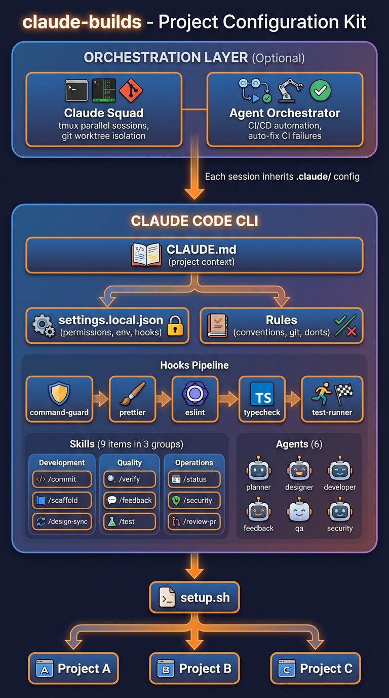

# claude-builds

Claude Code 프로젝트 설정 킷. 에이전트, 스킬, 훅, 규칙을 새 프로젝트에 한 번에 적용한다.

## 빠른 시작

```bash
# 1. 클론
git clone https://github.com/SONGYEONGSIN/claude-builds.git

# 2. 새 프로젝트에 적용
cd /your/project
bash /path/to/claude-builds/setup.sh

# 2-1. 오케스트레이터 포함 설치 (선택)
bash /path/to/claude-builds/setup.sh --with-orchestrators

# 3. 프로젝트별 설정
# .claude/settings.local.json → env 섹션에 환경변수 추가
# CLAUDE.md → {{PROJECT_DESCRIPTION}} 채우기
```

## 아키텍처



<details>
<summary>텍스트 다이어그램 보기</summary>

```
┌─────────────────────────────────────────────────────────────────────┐
│                   Orchestration Layer (선택)                         │
│                                                                     │
│  ┌──────────────────────────────┐ ┌──────────────────────────────┐  │
│  │   Claude Squad (로컬 병렬)    │ │ Agent Orchestrator (CI/CD)   │  │
│  │                               │ │                              │  │
│  │  tmux 세션 × N                │ │ GitHub 이슈 → 에이전트 할당  │  │
│  │  각 세션 = git worktree       │ │ CI 실패 → 자동 수정          │  │
│  │  프로필로 에이전트 선택        │ │ 리뷰 코멘트 → 자동 대응      │  │
│  │  cs → TUI 실행                │ │ ao spawn → 에이전트 생성     │  │
│  └──────────────────────────────┘ └──────────────────────────────┘  │
│              │                              │                        │
│              └──────────┬───────────────────┘                        │
│                         ▼                                            │
│              각 세션이 .claude/ 설정 상속                              │
└─────────────────────────────────────────────────────────────────────┘
                          │
                          ▼
┌─────────────────────────────────────────────────────────────────────┐
│                        Claude Code CLI                              │
│                                                                     │
│  ┌───────────────────────────────────────────────────────────────┐  │
│  │                     CLAUDE.md (프로젝트 컨텍스트)               │  │
│  │            tech stack · structure · commands · rules            │  │
│  └───────────────────────────────────────────────────────────────┘  │
│                                │                                    │
│                    ┌───────────┴───────────┐                        │
│                    ▼                       ▼                        │
│  ┌──────────────────────┐   ┌──────────────────────────────────┐   │
│  │   settings.local.json │   │          Rules (6개)              │   │
│  │                       │   │  conventions · git · donts · design│   │
│  │                       │   │  tdd · debugging                   │   │
│  │  permissions (allow)  │   │                                   │   │
│  │  permissions (deny)   │   │  + 프로젝트별 규칙 (supabase 등)  │   │
│  │  env variables        │   └──────────────────────────────────┘   │
│  │  hooks config         │                                          │
│  └──────────┬────────────┘                                          │
│             │                                                       │
│             ▼                                                       │
│  ┌──────────────────────────────────────────────────────────────┐   │
│  │                     Hooks Pipeline (22개)                     │   │
│  │                                                               │   │
│  │  ┌─ PreToolUse ──────────────────────────────────────────┐   │   │
│  │  │  command-guard.sh  ── 위험 명령 차단 (force push 등)   │   │   │
│  │  │  smart-guard.sh    ── 학습 패턴 기반 2차 검증          │   │   │
│  │  └────────────────────────────────────────────────────────┘   │   │
│  │                          │                                    │   │
│  │                    [도구 실행]                                 │   │
│  │                          │                                    │   │
│  │  ┌─ PostToolUse (Write|Edit) ────────────────────────────┐   │   │
│  │  │  prettier-format.sh    ── 코드 포맷팅                  │   │   │
│  │  │  eslint-fix.sh         ── 린트 자동 수정               │   │   │
│  │  │  typecheck.sh          ── TypeScript 타입 체크         │   │   │
│  │  │  test-runner.sh        ── 관련 테스트 실행             │   │   │
│  │  │  metrics-collector.sh  ── 메트릭 자동 수집             │   │   │
│  │  │  pattern-check.sh      ── 학습 패턴 준수 확인          │   │   │
│  │  │  design-lint.sh        ── 하드코딩 색상 감지           │   │   │
│  │  │  debate-trigger.sh     ── 자동 토론 트리거             │   │   │
│  │  └────────────────────────────────────────────────────────┘   │   │
│  │                                                               │   │
│  │  ┌─ Stop (세션 종료) ────────────────────────────────────┐   │   │
│  │  │  uncommitted-warn.sh ── 미커밋 변경 경고               │   │   │
│  │  │  session-review.sh   ── 세션 품질 종합 리뷰            │   │   │
│  │  │  session-log.sh      ── 세션 로그 + 메트릭 요약        │   │   │
│  │  └────────────────────────────────────────────────────────┘   │   │
│  └──────────────────────────────────────────────────────────────┘   │
│                                                                     │
│  ┌──────────────────────────────────────────────────────────────┐   │
│  │                    Skills (18개) — /명령어                     │   │
│  │                                                               │   │
│  │  ┌─ 개발 ────────┐  ┌─ 품질 ────────┐  ┌─ 운영 ────────┐   │   │
│  │  │ /commit        │  │ /verify       │  │ /status       │   │   │
│  │  │ /scaffold      │  │ /feedback     │  │ /security     │   │   │
│  │  │ /design-sync   │  │ /test         │  │ /review-pr    │   │   │
│  │  └────────────────┘  │ /eval-skill   │  └───────────────┘   │   │
│  │                       └───────────────┘                       │   │
│  │  ┌─ 학습 ────────┐  ┌─ 협업 ────────┐                       │   │
│  │  │ /metrics       │  │ /discuss      │                       │   │
│  │  │ /learn         │  └───────────────┘                       │   │
│  │  │ /retrospective │                                          │   │
│  │  └────────────────┘                                          │   │
│  └──────────────────────────────────────────────────────────────┘   │
│                                │                                    │
│                                ▼                                    │
│  ┌──────────────────────────────────────────────────────────────┐   │
│  │                    Agents (12개) — 전문 위임                   │   │
│  │                                                               │   │
│  │   ┌──────────┐ ┌──────────┐ ┌──────────┐ ┌─────────────┐   │   │
│  │   │ planner  │ │ designer │ │developer │ │retrospective│   │   │
│  │   │ 작업 분해 │ │ UI/UX    │ │ 구현     │ │ 회고/학습    │   │   │
│  │   └──────────┘ └──────────┘ └──────────┘ └─────────────┘   │   │
│  │   ┌──────────┐ ┌──────────┐ ┌──────────┐ ┌─────────────┐   │   │
│  │   │ feedback │ │    qa    │ │ security │ │   grader    │   │   │
│  │   │ 코드리뷰  │ │ 테스트   │ │ 보안스캔 │ │ eval 평가   │   │   │
│  │   └──────────┘ └──────────┘ └──────────┘ └─────────────┘   │   │
│  │   ┌────────────┐ ┌────────────────┐ ┌─────────────┐          │   │
│  │   │ comparator │ │ skill-reviewer │ │  moderator  │          │   │
│  │   │ A/B 비교    │ │ 스킬 품질 검증  │ │ 토론 중재   │          │   │
│  │   └────────────┘ └────────────────┘ └─────────────┘          │   │
│  └──────────────────────────────────────────────────────────────┘   │
│                                                                     │
└─────────────────────────────────────────────────────────────────────┘

                    ┌─────────────────────┐
                    │    setup.sh          │
                    │                     │
                    │  claude-builds 에서  │
                    │  프로젝트로 복사     │
                    └──────────┬──────────┘
                               │
              ┌────────────────┼────────────────┐
              ▼                ▼                ▼
     ┌──────────────┐ ┌──────────────┐ ┌──────────────┐
     │  Project A   │ │  Project B   │ │  Project C   │
     │  .claude/    │ │  .claude/    │ │  .claude/    │
     │  ├─agents/   │ │  ├─agents/   │ │  ├─agents/   │
     │  ├─hooks/    │ │  ├─hooks/    │ │  ├─hooks/    │
     │  ├─skills/   │ │  ├─skills/   │ │  ├─skills/   │
     │  └─rules/    │ │  └─rules/    │ │  └─rules/    │
     └──────────────┘ └──────────────┘ └──────────────┘
```

### 워크플로우

```
사용자 입력
    │
    ▼
┌─ Rules 참조 ──────────────────────────────────────────┐
│  conventions + git + donts + design + tdd + debugging   │
└────────────────────────────────────────────────────────┘
    │
    ▼
┌─ 작업 유형 판별 ──────────────────────────────────────┐
│                                                        │
│  스킬 호출 (/commit 등)  →  Skill 실행                 │
│  복잡한 작업             →  Agent 위임 (planner 등)    │
│  일반 코딩               →  직접 수행                  │
│                                                        │
└────────────────────────────────────────────────────────┘
    │
    ▼
┌─ 코드 수정 (Write/Edit) ─────────────────────────────┐
│                                                        │
│  PreToolUse   → command-guard + smart-guard (차단/검증) │
│  도구 실행    → 파일 생성/수정                         │
│  PostToolUse  → prettier → eslint → tsc → test        │
│               → pattern-check → debate-trigger         │
│                                                        │
└────────────────────────────────────────────────────────┘
    │
    ▼
┌─ 세션 종료 ──────────────────────────────────────────┐
│  uncommitted-warn → session-review → session-log       │
└────────────────────────────────────────────────────────┘
```

</details>

## 구성 요소

### Agents (12개)

| 에이전트 | 역할 | 모델 |
|---------|------|------|
| `comparator` | 블라인드 A/B 출력 비교, 루브릭 기반 점수 산출 | opus |
| `designer` | UI/UX 디자인, Tailwind CSS 스타일링 | opus |
| `developer` | Server Actions, React 컴포넌트 구현 | opus |
| `feedback` | 코드 품질 분석, 개선 제안 | opus |
| `grader` | eval 결과 채점, PASS/FAIL 판정 + 근거 | opus |
| `moderator` | 에이전트 간 토론 중재, 합의 도출 | opus |
| `planner` | 작업 분해, 영향 분석, 구현 계획 | opus |
| `qa` | Vitest + Playwright 테스트 작성/실행 | opus |
| `retrospective` | 메트릭 분석 → 에이전트/스킬/규칙 개선안 도출 | opus |
| `security` | OWASP Top 10 보안 스캔 | opus |
| `skill-reviewer` | 스킬 품질 8단계 검토, 100점 스코어카드 | opus |
| `validator` | Pair mode 품질 게이트 — Builder 작업을 fresh-context로 검증, binary 판정(approved/needs-revision) | opus |

### Skills (18개)

| 스킬 | 호출 | 설명 |
|------|------|------|
| `commit` | `/commit` | Conventional Commit 자동 생성 |
| `design-sync` | `/design-sync <URL\|이미지>` | 디자인 URL/캡처 이미지에서 CSS 추출 → 코드 싱크 ([상세](#design-sync-상세)) |
| `discuss` | `/discuss "주제"` | 에이전트 간 토론 개시 — 주제별 자동 참가자 선정 + 구조화된 토론 |
| `eval-skill` | `/eval <skill-name>` | 스킬 품질 정량 평가 — evals.json 기반 테스트 + grader 채점 |
| `feedback` | `/feedback` | 최근 변경사항 품질 분석 |
| `learn` | `/learn [save\|show]` | 프로젝트 메모리 관리 — 패턴/에러 해결법 저장·조회 |
| `metrics` | `/metrics [today\|week\|all]` | 메트릭 대시보드 — 빌드 성공률, 에러 빈도, 핫스팟 |
| `retrospective` | `/retrospective` | 종합 회고 — 메트릭 분석 → 에이전트/스킬/규칙 개선안 도출 |
| `review-pr` | `/review-pr [N]` | GitHub PR 코드 리뷰 |
| `scaffold` | `/scaffold [domain]` | 새 도메인 보일러플레이트 생성 |
| `security` | `/security` | 전체 코드 보안 스캔 |
| `status` | `/status` | 프로젝트 상태 대시보드 |
| `test` | `/test [file]` | 단위 테스트 자동 생성 |
| `design-audit` | `/design-audit` | 디자인 시스템 준수 점검 — 색상 토큰 커버리지, 중복 패턴 감지 |
| `verify` | `/verify` | lint → typecheck → test → e2e 검증 |
| `worktree` | `/worktree [create\|list\|remove]` | Git worktree 격리 작업 환경 생성/관리 |
| `pair` | `/pair "task"` | Builder+Validator 페어 — developer → validator 루프 자동 오케스트레이션 (최대 3 iteration, 교착 시 moderator 소환) |
| `evolve` | `/evolve <skill>` | 스킬 자동 개선 — eval 결과 분석 → 후보 생성 → 5개 제약 게이트 → A/B 블라인드 비교 (Hermes Agent 패턴) |

### Hooks (22개)

| 훅 | 트리거 | 역할 |
|----|--------|------|
| `command-guard.sh` | PreToolUse (Bash) | 위험 명령 차단 (패턴 매칭) |
| `smart-guard.sh` | PreToolUse (Bash) | 학습 패턴 기반 2차 검증 (memory/patterns.md 참조) |
| `tdd-enforce.sh` | PreToolUse (Write/Edit) | 테스트 파일 없이 소스 수정 시 경고 (strict 모드로 차단 전환 가능) |
| `prettier-format.sh` | PostToolUse (Write/Edit) | 코드 포맷팅 |
| `eslint-fix.sh` | PostToolUse (Write/Edit) | 린트 자동 수정 |
| `typecheck.sh` | PostToolUse (Write/Edit) | TypeScript 타입 체크 |
| `test-runner.sh` | PostToolUse (Write/Edit) | 관련 테스트 실행 |
| `metrics-collector.sh` | PostToolUse (Write/Edit) | 메트릭 자동 수집 |
| `pattern-check.sh` | PostToolUse (Write/Edit) | 학습 패턴 준수 확인 (비차단) |
| `design-lint.sh` | PostToolUse (Write/Edit) | 하드코딩 색상 감지 (비차단 경고) |
| `debate-trigger.sh` | PostToolUse (Write/Edit) | 충돌 패턴 감지 시 자동 토론 트리거 |
| `tool-failure-handler.sh` | PostToolUseFailure | 도구 실행 실패 자동 로깅 + 복구 힌트 |
| `uncommitted-warn.sh` | Stop | 미커밋 변경 경고 |
| `session-review.sh` | Stop | 세션 품질 종합 리뷰 (메트릭 요약 + 학습 제안) |
| `session-log.sh` | Stop | 세션 로그 저장 |
| `readme-sync.sh` | PostToolUse (Write/Edit) | README/아키텍처 수치 자동 동기화 (비차단) |
| `notify.sh` | Notification (idle_prompt) | 사용자 입력 대기 시 데스크톱 알림 (macOS) |
| `pre-compact.sh` | PreCompact | 컨텍스트 압축 전 중요 정보(브랜치/커밋/미커밋) 보존 |
| `message-bus.sh` | — (유틸리티) | 에이전트 간 메시지 전송/수신/아카이브 |
| `context-prune.sh` | PreCompact | 컨텍스트 압축 전 도구 출력 1줄 요약 (Hermes Agent 패턴, 12KB 예산) |
| `model-suggest.sh` | Notification (idle_prompt) | events.jsonl 패턴 분석 → 모델 전환 비차단 제안 (15분 디바운스) |
| `_common.sh` | — (유틸리티) | 공용 함수: truncate_log_file, get_file_mtime, generate_random_hex |

### Rules (6개 공통 + 템플릿)

| 규칙 | 내용 |
|------|------|
| `conventions.md` | 설계 선행 원칙, 코드 스타일, Server Action 패턴 |
| `git.md` | Conventional Commits, HARD-GATE 설계 등급, Git Worktree |
| `design.md` | 디자인 토큰 중앙 관리, 하드코딩 색상 금지, 공통 컴포넌트 추출 규칙 |
| `donts.md` | 코드 품질, 보안, 완료 기준, 합리화 방지 표 |
| `tdd.md` | TDD Iron Law — RED-GREEN-REFACTOR 강제 |
| `debugging.md` | 4단계 체계적 디버깅 프로세스 (관찰→가설→검증→수정) |
| `templates/rules/supabase.md` | Supabase 프로젝트용 규칙 (선택) |

## Design Sync 상세

참고 디자인(URL 또는 캡처 이미지)에서 CSS를 자동 추출하여 코드베이스에 적용하고, 정량적 싱크율로 검증하는 스킬.

### 사용법

```bash
# URL 기반 — 7단계 전체 워크플로우
/design-sync https://example.figma.site

# URL 기반 — 특정 페이지만
/design-sync https://example.figma.site /dashboard

# 이미지 기반 — 5단계 워크플로우
/design-sync --from-image ./reference-design.png

# 검증만
/design-sync --verify-only

# 토큰 추출만
/design-sync --tokens-only
```

### URL 모드 (7단계)

라이브 URL에서 Playwright로 computed style을 직접 추출한다. 가장 정밀하며 **싱크율 95% 이상** 목표.

```
Step 1 → 토큰 추출       보정 계수 자동 산출 + 글로벌 토큰 JSON
Step 2 → 인벤토리        전체 페이지 원패스 추출 → 영역/타입별 분류
Step 3 → 기준 측정       참고 + 로컬 스크린샷 비교 → 초기 싱크율
Step 4 → 매핑 + Diff     참고 요소 ↔ 코드베이스 매핑 → 변경 제안
Step 5 → 수정 적용       파일별 × 카테고리별 수정, tsc+test 검증
Step 6 → 최종 검증       다시 스크린샷 비교 → 최종 싱크율
Step 7 → 학습 + 정리     90%↑ 시 패턴 저장, 임시 파일 삭제
```

### 이미지 모드 (5단계)

URL 없이 캡처 이미지(PNG/JPG/WebP)만으로 디자인을 추출한다. **AI Vision + Sharp** 조합으로 분석하며 **싱크율 85~90%** 목표.

```
Step I-1 → AI Vision 토큰 추출    이미지 분석 → 색상/타이포/간격/레이아웃
Step I-2 → AI Vision 인벤토리     영역 분할 → 컴포넌트 식별·분류
Step I-3 → 비주얼 비교            로컬 스크린샷 vs 원본 이미지 pixelmatch
Step I-4 → 매핑 + 수정 적용       URL 모드 Phase 4~5와 동일
Step I-5 → 최종 검증 + 정리       URL 모드 Phase 6~7과 동일
```

### 추출 범위

**8개 요소 카테고리:**

| # | 카테고리 | 대상 요소 |
|---|---------|----------|
| 1 | 레이아웃 | `aside`, `header`, `main`, `nav`, 사이드바 |
| 2 | 헤딩 | `h1`~`h6` — 페이지/카드/섹션 제목 |
| 3 | 텍스트 | `p`, `span`, `label`, `li`, `a` — 설명, 배지, 링크 |
| 4 | 카드/컨테이너 | `div`(border/bg/rounded), `section` |
| 5 | 폼 | `input`, `select`, `button`, `textarea` |
| 6 | 검색/필터/드롭다운 | 검색 컨테이너(relative wrapper + 아이콘), 필터 바/칩, 커스텀 드롭다운 패널/아이템 |
| 7 | 테이블 | `table`, `thead`, `tbody`, `tr`, `th`, `td` |
| 8 | 아이콘 | `svg`, `img[src*=".svg"]` — 크기, 색상, strokeWidth |

**21개 속성 카테고리:**

| # | 카테고리 | 주요 속성 |
|---|---------|----------|
| 1 | 셀렉터 | `tag.className` |
| 2 | 크기 | `width`, `height`, `minWidth`, `maxWidth`, `minHeight`, `maxHeight`, `aspectRatio` |
| 3 | 색상 | `color`, `backgroundColor`, `opacity` |
| 4 | 서체 | `fontFamily`, `fontSize`, `fontWeight`, `fontStyle`, `lineHeight`, `letterSpacing` |
| 5 | 텍스트 | `textAlign`, `textTransform`, `textDecoration`, `whiteSpace`, `textOverflow`, `wordBreak`, `textShadow` |
| 6 | 패딩 | 4방향 축약 |
| 7 | 마진 | 4방향 축약 |
| 8 | 보더 | `border`, `borderColor`, `borderWidth`, `borderRadius`, `outline`, `outlineOffset` |
| 9 | 시각효과 | `boxShadow`, `backgroundImage`(그라데이션), `filter`, `backdropFilter`, `mixBlendMode`, `clipPath` |
| 10 | 레이아웃 | `display`, `flex*`, `grid*`, `gap`, `position`, `overflow`, `zIndex`, `isolation`, `columns` |
| 11 | 포지셔닝 | `top`, `right`, `bottom`, `left`, `inset` |
| 12 | 트랜스폼 | `transform`, `transformOrigin` |
| 13 | 인터랙션 | `cursor`, `transition*`, `pointerEvents`, `userSelect`, `resize`, `scrollBehavior`, `scrollSnap*` |
| 14 | 이미지/미디어 | `objectFit`, `objectPosition` |
| 15 | 폼 스타일 | `appearance`, `accentColor`, `caretColor` |
| 16 | 접근성 | Contrast ratio, accessible name, ARIA role, `visibility` |
| 17 | CSS 변수 | `--background`, `--foreground`, `--primary` 등 |
| 18 | 의사 요소 | `::before`, `::after` — content, 크기, 색상 |
| 19 | 선택 스타일 | `::selection` — color, backgroundColor |
| 20 | 아이콘 | SVG `width`, `height`, `stroke`, `fill` |
| 21 | 애니메이션 | `animationName`, `animationDuration`, `listStyleType` |

### 비주얼 비교 기능

URL 모드에서는 다음 비교를 모두 수행한다:

| 비교 유형 | 설명 |
|----------|------|
| **기본 비교** | pixelmatch threshold 0.15 |
| **정밀 비교** | threshold 0.05 — 미세 간격/색상 차이 검출 |
| **컴포넌트 단위** | sidebar/header/content 영역 분리 비교 |
| **인터랙션** | hover/active/focus 상태 캡처 + computed style diff |
| **텍스트 마스킹** | 텍스트 transparent 처리 → 순수 레이아웃 비교 |
| **멀티 뷰포트** | 375×812, 768×1024, 1366×900, 1920×1080 |
| **다크 모드** | colorScheme + class 토글 비교 |
| **스크롤 영역** | fullPage 캡처 → 뷰포트 단위 분할 비교 |

### 모드 비교

| 항목 | URL 모드 | 이미지 모드 |
|------|---------|------------|
| 입력 | 라이브 URL | PNG/JPG/WebP |
| 추출 도구 | Playwright computed styles | AI Vision + Sharp |
| hover/인터랙션 | 캡처 가능 | 불가 |
| 반응형 | 멀티 뷰포트 | 단일 |
| 싱크율 목표 | **95%+** | **85~90%** |

### 의존성

```bash
npm install -D playwright pixelmatch pngjs   # URL + 이미지 공통
npm install -D sharp                          # 이미지 모드 전용
npx playwright install chromium
```

### designer 에이전트 연동

designer 에이전트는 레퍼런스 유형에 따라 design-sync를 자동 실행한다:

| 레퍼런스 | 동작 |
|----------|------|
| URL 제공 | `/design-sync <URL>` 전체 7단계 실행 → 싱크율 95%+ 목표 |
| 이미지 제공 | `/design-sync --from-image <경로>` 5단계 실행 → 싱크율 85~90% 목표 |
| 없음 | 프로젝트 유형 판단 → 디자인 토큰 자율 설계 |

---

## Design System Enforcement

프로젝트의 디자인 일관성을 자동으로 유지하는 4중 레이어.

### 레이어

| 레이어 | 구성 요소 | 동작 |
|--------|----------|------|
| 입력 | `DESIGN.md` (루트 또는 `design-ref/`) | VoltAgent/Google Stitch 9섹션 포맷 → 토큰/규칙 자동 주입 |
| 규칙 | `rules/design.md` | 에이전트가 따르는 디자인 토큰/색상/컴포넌트 규칙 + DESIGN.md §7 Don'ts 병합 |
| 훅 | `hooks/design-lint.sh` | Write/Edit 시 하드코딩 색상 자동 감지 (비차단 경고) |
| 스킬 | `/design-audit` | 온디맨드 코드베이스 전체 디자인 감사 |

### DESIGN.md 통합 (VoltAgent/Google Stitch)

프로젝트 루트에 `DESIGN.md`를 드롭하면 `designer` 에이전트가 자동으로 인식하여 9개 섹션을 Phase 0/토큰/규칙에 매핑한다.

- **§1 Visual Theme** → Phase 0 "톤" 자동 결정 (미학 카탈로그 선택 스킵)
- **§2 Color Palette** → `design-tokens.ts`의 우선 소스 (hex → oklch 변환)
- **§3 Typography** → Display/Body 폰트 페어링
- **§4 Component Stylings** → 버튼/카드/인풋/내비 설계 스펙
- **§5 Layout Principles** → spacing 스케일 + 그리드
- **§6 Depth & Elevation** → shadows 토큰
- **§7 Do's and Don'ts** → 안티-제네릭 가드레일 위에 세션 체크리스트로 로드
- **§8 Responsive Behavior** → 브레이크포인트 + 터치 타깃
- **§9 Agent Prompt Guide** → 프롬프트 템플릿

**파일 탐색 우선순위**: 루트 `DESIGN.md` > `design-ref/DESIGN.md` > `design-ref/readme.md` > `design-ref/*.html`

**브랜드별 예시 66개**: [VoltAgent/awesome-design-md](https://github.com/VoltAgent/awesome-design-md) (Stripe, Linear, Notion, Apple, Tesla 등) — 원하는 브랜드 `DESIGN.md`를 복사해서 드롭인하면 해당 브랜드 스타일로 UI 생성.

### 디자인 토큰

프로젝트의 `src/lib/design-tokens.ts`에 색상, 간격, 타이포그래피 등을 `as const` 객체로 정의.
`tailwind.config.ts`의 `theme.extend`에서 참조하여 프로젝트 전용 유틸리티 클래스 생성.

### 공통 컴포넌트

`src/components/common/`에 3회 이상 반복되는 UI 패턴을 추출하여 관리.
`ui/`(원자 수준 — shadcn)와 구분되는 조합(molecule) 수준 컴포넌트.

### 감지 대상

- 하드코딩 hex 색상: `#xxx`, `#xxxxxx`, `#xxxxxxxx`
- CSS 색상 함수: `rgb()`, `rgba()`, `hsl()`, `hsla()`
- 예외: `tailwind.config.*`, `design-tokens.*`, `globals.css`

---

## 디렉토리 구조

```
claude-builds/
├── README.md
├── setup.sh                       # 원클릭 설치 스크립트 (--with-orchestrators)
├── settings/
│   └── settings.template.json     # 권한, 훅, env, MCP 서버 템플릿
├── agents/                        # 12개 전문 에이전트
├── hooks/                         # 22개 자동화 훅
├── skills/                        # 18개 CLI 스킬
├── rules/                         # 6개 공통 규칙
├── docs/
│   └── architecture.png           # 아키텍처 다이어그램
├── orchestrators/                 # 오케스트레이터 설정 (선택)
│   ├── README.md
│   ├── claude-squad/
│   │   └── config.template.json
│   └── agent-orchestrator/
│       └── agent-orchestrator.template.yaml
└── templates/                     # 프로젝트별 템플릿
    ├── CLAUDE.md.template
    ├── playwright.config.ts       # Playwright E2E + HTML 리포트 설정
    ├── evals/
    │   └── evals.template.json    # eval 테스트 템플릿
    └── rules/
        └── supabase.md
```

## 프로젝트별 커스텀

setup 후 추가할 수 있는 항목:

- `.claude/rules/` — 프로젝트 고유 규칙 추가 (예: `supabase.md`, `prisma.md`)
- `.claude/settings.local.json` — `env`에 환경변수, `deny`에 위험 명령 추가
- `.claude/agents/` — 프로젝트 특화 에이전트 추가
- `.claude/skills/` — 프로젝트 특화 스킬 추가

## 오케스트레이터 (선택)

멀티 에이전트 세션을 관리하는 도구. `setup.sh --with-orchestrators`로 설정.

### Claude Squad — 로컬 병렬 작업

```bash
brew install claude-squad
cs                          # TUI 실행, 프로필로 에이전트 지정
```

12개 에이전트가 프로필로 매핑. 각 세션은 독립 git worktree에서 실행되어 충돌 없이 병렬 작업 가능. 에이전트 간 파일 기반 메시지 버스로 통신.

| 프로필 | 에이전트 | 역할 |
|--------|----------|------|
| `planner` | planner.md | 작업 분해, 영향 분석 |
| `designer` | designer.md | UI/UX 설계 |
| `developer` | developer.md | 코드 구현 |
| `feedback` | feedback.md | 코드 품질 리뷰 |
| `qa` | qa.md | 테스트 작성/실행 |
| `security` | security.md | OWASP 보안 스캔 |
| `retrospective` | retrospective.md | 메트릭 분석, 개선안 도출 |
| `grader` | grader.md | eval 결과 채점 |
| `comparator` | comparator.md | 블라인드 A/B 비교 |
| `skill-reviewer` | skill-reviewer.md | 스킬 품질 8단계 검토 |
| `moderator` | moderator.md | 에이전트 간 토론 중재 |

### Agent Orchestrator — CI/CD 자동화

```bash
# 설치: https://github.com/ComposioHQ/agent-orchestrator
ao start                    # 오케스트레이터 시작
ao spawn my-app ISSUE-42    # 이슈에 에이전트 할당
```

| 이벤트 | 동작 |
|--------|------|
| CI 실패 | 에이전트가 로그 분석 → 자동 수정 (2회 재시도) |
| 변경 요청 | 리뷰 코멘트 기반 자동 수정 |
| 승인 + 통과 | 알림 (자동 머지 옵션) |

### 조합 워크플로우

```
로컬 개발 (Claude Squad)          CI/CD (Agent Orchestrator)
┌────────────────────┐           ┌──────────────────────┐
│ 세션1: 프론트엔드    │  PR push  │ CI 실패 → 자동 수정   │
│ 세션2: 백엔드 API   │ ───────→ │ 리뷰 → 자동 반영      │
│ 세션3: 테스트       │           │ 승인 → 머지 알림      │
└────────────────────┘           └──────────────────────┘
```

자세한 내용은 [`orchestrators/README.md`](orchestrators/README.md) 참조.

## 에이전트 간 통신

에이전트끼리 파일 기반 메시지 버스로 통신하고, 의견 충돌 시 구조화된 토론을 통해 합의를 도출한다.

### 메시지 버스

`hooks/message-bus.sh`가 에이전트 간 통신 인프라를 제공한다.

```bash
# 메시지 전송
bash .claude/hooks/message-bus.sh send <from> <to> <type> <priority> "<subject>" "<body>"

# 수신함 확인
bash .claude/hooks/message-bus.sh list <agent-name>

# 전체 공지
bash .claude/hooks/message-bus.sh broadcast <from> <type> <priority> "<subject>" "<body>"
```

모든 에이전트는 세션 시작 시 자신의 수신함을 확인하고, `critical`/`high` 메시지를 우선 처리한다.

### 토론 시스템

충돌 패턴 감지 시 `moderator` 에이전트가 구조화된 토론을 진행한다.

```
충돌 감지 (훅 / 에이전트 알림 / /discuss 명령)
    ↓
Opening — 각 참가자가 입장·논거·근거·확신도 제출
    ↓
Rebuttals (최대 3라운드) — 상대 논거 반박, 확신도 업데이트
    ↓
Verdict — moderator 최종 판정 + action_items + memory 업데이트
```

**자동 트리거 조건** (`debate-trigger.sh`):
- 인증 관련 파일에서 TypeScript 에러 → security + developer 토론
- Server Action 테스트 실패 → qa + developer 토론
- 같은 파일 3회 이상 실패 → developer + feedback + qa 토론

**수동 토론**: `/discuss "주제"` 또는 `/discuss "주제" --agents qa,developer`

### 통신 디렉토리

```
.claude/messages/
├── inbox/           # 에이전트별 수신함 (gitignore)
├── archive/         # 처리된 메시지 (gitignore)
├── debates/         # 토론 기록 (git 추적, 영구 보관)
└── broadcast/       # 전체 공지 (gitignore)
```

---

## 학습 시스템

코드 수정 시 메트릭이 자동 수집되고, 프로젝트 경험이 `.claude/memory/`에 축적된다.

### 데이터 흐름

```
[코드 수정] → metrics-collector.sh → .claude/metrics/daily-*.json
[코드 수정] → pattern-check.sh → 학습 패턴 준수 피드백
[코드 수정] → debate-trigger.sh → 충돌 감지 시 자동 토론 개시
[세션 종료] → session-review.sh → 세션 품질 종합 리뷰 (+ 에이전트 알림)
[세션 종료] → session-log.sh → .claude/session-logs/ (메트릭 요약 포함)
[사용자 호출] → /eval <skill> → evals.json 테스트 → benchmark.json
[사용자 호출] → /discuss "주제" → moderator 토론 → .claude/messages/debates/
[사용자 호출] → /retrospective → 종합 분석 + eval + 토론 데이터 → .claude/memory/ 업데이트
```

### 메트릭 자동 수집

`metrics-collector.sh` 훅이 매 파일 수정 시 기존 훅(prettier, eslint, typecheck, test)의 결과를 수집하여 일별 JSON에 기록한다. 비침습적으로 동작하며, 실패해도 기존 워크플로우를 차단하지 않는다.

### 스킬

| 스킬 | 설명 |
|------|------|
| `/metrics [today\|week\|all]` | 빌드 성공률, 에러 빈도, 핫스팟 파일 대시보드 |
| `/learn save [pattern\|error\|profile]` | 코드 패턴, 에러 해결법, 프로젝트 특성 저장 |
| `/learn show` | 축적된 학습 메모리 조회 |
| `/retrospective` | 전체 이력 분석 → 에이전트/스킬/규칙 개선안 도출 |

### 메모리 구조

```
.claude/memory/
├── patterns.md           # 코드 패턴, 에러 해결법
├── project-profile.md    # 프로젝트별 특성 (DB, API, 서비스)
└── improvements.md       # 회고 개선 이력
```

### Eval 프레임워크

스킬 품질을 정량 측정하는 인프라. `/eval <skill-name>`으로 실행.

```
evals.json (테스트 프롬프트) → subagent 실행 → grader 채점 → benchmark.json
                                                    ↓
                                             comparator (A/B 비교, 선택)
                                                    ↓
                                             retrospective가 추이 분석
```

- `grader` 에이전트: 기대 결과 vs 실제 출력 비교 → PASS/FAIL + 점수(0.0-1.0)
- `comparator` 에이전트: 블라인드 A/B 비교 → Content(60점) + Structure(40점) 루브릭
- `skill-reviewer` 에이전트: SKILL.md 구조 8단계 검토 → 100점 스코어카드
- 초기 eval: commit(4), discuss(2), verify(3), security(3) 스킬에 evals.json 제공

### 피드백 루프

1. **일상 개발** — 메트릭이 자동 축적 (개발자는 차이를 느끼지 못함)
2. **패턴 발견** — `/learn save`로 해결법 저장 → 다음 세션에서 자동 참조
3. **품질 측정** — `/eval`로 스킬 정량 평가 → benchmark.json 축적
4. **정기 회고** — `/retrospective`로 메트릭 + eval 데이터 분석 → 구체적 개선안 (P0/P1/P2)
5. **개선 검증** — skill-reviewer가 스킬 변경 품질 게이트 → 퇴보 방지
6. **개선 적용** — 규칙/에이전트/스킬 업데이트 → 다음 회고에서 효과 측정

## 기본 기술 스택

claude-builds는 아래 기술 스택이 **확정**되어 있다. 프로젝트 생성 시 별도 선택 없이 바로 적용된다.

| 항목 | 기술 |
|------|------|
| Framework | Next.js (App Router) + TypeScript |
| Styling | Tailwind CSS 4 |
| Database / Auth | Supabase (@supabase/ssr) |
| Validation | zod |
| Testing | Vitest (unit) + Playwright (E2E) |
| Linting | ESLint + Prettier |

> **고급 사용자**: 다른 스택을 사용하려면 hooks와 rules를 직접 수정해야 한다.
> hooks의 Prettier/ESLint/TypeScript 경로, rules의 conventions를 프레임워크에 맞게 변경.

## 라이선스

MIT
