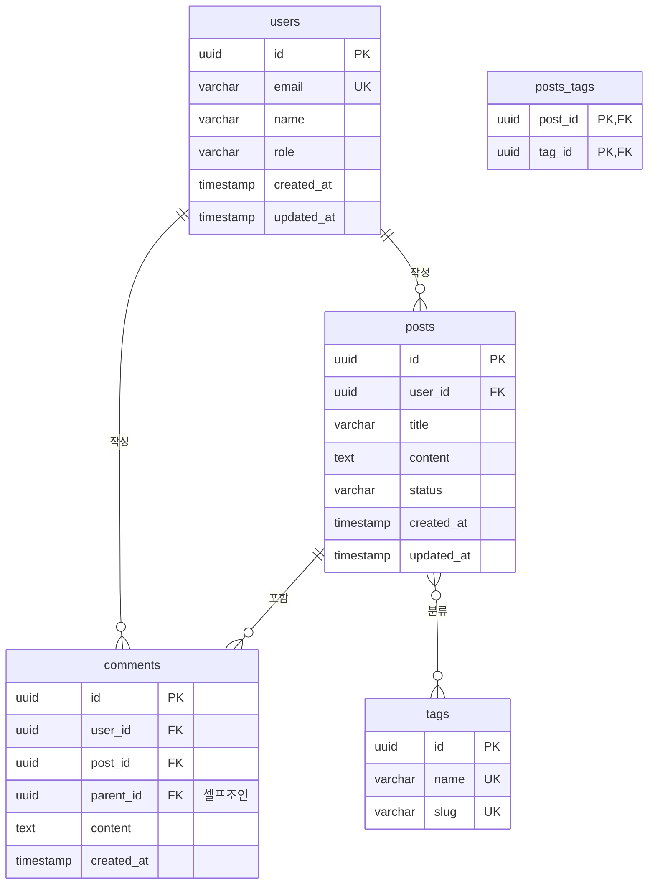

# ERD (Entity Relationship Diagram) 템플릿

## 1. 엔티티 목록

| 엔티티 | 설명 | 주요 속성 | 예상 레코드 수 |
|--------|------|----------|--------------|
| User | 사용자 | id, email, name, role | 10,000+ |
| {Entity2} | {설명} | {속성들} | {예상 수} |
| {Entity3} | {설명} | {속성들} | {예상 수} |

---

## 2. ERD 다이어그램

### 2.1 Mermaid ERD



### 2.2 ASCII 다이어그램

```
┌─────────────┐       ┌─────────────┐
│    users    │       │    posts    │
├─────────────┤       ├─────────────┤
│ id (PK)     │───┐   │ id (PK)     │
│ email (UK)  │   │   │ user_id(FK) │──┐
│ name        │   │   │ title       │  │
│ role        │   └──<│ content     │  │
│ created_at  │       │ status      │  │
│ updated_at  │       │ created_at  │  │
└─────────────┘       └─────────────┘  │
                            │          │
                            │          │
┌─────────────┐       ┌─────────────┐  │
│   comments  │       │    tags     │  │
├─────────────┤       ├─────────────┤  │
│ id (PK)     │       │ id (PK)     │  │
│ user_id(FK) │<──────│ name (UK)   │  │
│ post_id(FK) │<──┐   │ slug (UK)   │  │
│ parent_id   │───┘   └─────────────┘  │
│ content     │              │         │
│ created_at  │              │         │
└─────────────┘       ┌──────┴──────┐  │
                      │ posts_tags  │  │
                      ├─────────────┤  │
                      │ post_id(FK) │<─┘
                      │ tag_id(FK)  │
                      └─────────────┘
```

### 관계 표기법
- `───` : 1:1 관계
- `──<` 또는 `||--o{` : 1:N 관계
- `>──<` 또는 `}o--o{` : N:M 관계

---

## 3. 테이블 스키마

### 3.1 users (사용자)

```sql
CREATE TABLE users (
  id            UUID PRIMARY KEY DEFAULT gen_random_uuid(),
  email         VARCHAR(255) NOT NULL UNIQUE,
  name          VARCHAR(100) NOT NULL,
  role          VARCHAR(20) NOT NULL DEFAULT 'user'
                CHECK (role IN ('user', 'admin', 'moderator')),
  avatar_url    TEXT,
  is_active     BOOLEAN DEFAULT true,
  last_login_at TIMESTAMP,
  created_at    TIMESTAMP WITH TIME ZONE DEFAULT NOW(),
  updated_at    TIMESTAMP WITH TIME ZONE DEFAULT NOW()
);

-- 인덱스
CREATE INDEX idx_users_email ON users(email);
CREATE INDEX idx_users_role ON users(role);
CREATE INDEX idx_users_created_at ON users(created_at DESC);

-- updated_at 자동 갱신 트리거
CREATE OR REPLACE FUNCTION update_updated_at()
RETURNS TRIGGER AS $$
BEGIN
  NEW.updated_at = NOW();
  RETURN NEW;
END;
$$ LANGUAGE plpgsql;

CREATE TRIGGER users_updated_at
  BEFORE UPDATE ON users
  FOR EACH ROW
  EXECUTE FUNCTION update_updated_at();
```

| 컬럼 | 타입 | 제약조건 | 설명 |
|------|------|----------|------|
| id | UUID | PK | 고유 식별자 |
| email | VARCHAR(255) | NOT NULL, UNIQUE | 이메일 (로그인) |
| name | VARCHAR(100) | NOT NULL | 표시 이름 |
| role | VARCHAR(20) | CHECK, DEFAULT | 사용자 권한 |
| avatar_url | TEXT | - | 프로필 이미지 URL |
| is_active | BOOLEAN | DEFAULT true | 활성화 상태 |
| last_login_at | TIMESTAMP | - | 마지막 로그인 |
| created_at | TIMESTAMPTZ | DEFAULT NOW() | 생성일 |
| updated_at | TIMESTAMPTZ | DEFAULT NOW() | 수정일 |

---

### 3.2 posts (게시물 - 1:N 예시)

```sql
CREATE TABLE posts (
  id            UUID PRIMARY KEY DEFAULT gen_random_uuid(),
  user_id       UUID NOT NULL REFERENCES users(id) ON DELETE CASCADE,
  title         VARCHAR(200) NOT NULL,
  slug          VARCHAR(200) NOT NULL UNIQUE,
  content       TEXT,
  excerpt       VARCHAR(500),
  status        VARCHAR(20) NOT NULL DEFAULT 'draft'
                CHECK (status IN ('draft', 'published', 'archived')),
  view_count    INTEGER DEFAULT 0,
  published_at  TIMESTAMP WITH TIME ZONE,
  created_at    TIMESTAMP WITH TIME ZONE DEFAULT NOW(),
  updated_at    TIMESTAMP WITH TIME ZONE DEFAULT NOW()
);

-- 인덱스
CREATE INDEX idx_posts_user_id ON posts(user_id);
CREATE INDEX idx_posts_status ON posts(status);
CREATE INDEX idx_posts_slug ON posts(slug);
CREATE INDEX idx_posts_published_at ON posts(published_at DESC NULLS LAST);

-- 복합 인덱스: 사용자별 최신 게시물 조회
CREATE INDEX idx_posts_user_published ON posts(user_id, published_at DESC)
  WHERE status = 'published';

-- 트리거
CREATE TRIGGER posts_updated_at
  BEFORE UPDATE ON posts
  FOR EACH ROW
  EXECUTE FUNCTION update_updated_at();
```

---

### 3.3 comments (댓글 - 셀프조인 예시)

```sql
CREATE TABLE comments (
  id            UUID PRIMARY KEY DEFAULT gen_random_uuid(),
  user_id       UUID NOT NULL REFERENCES users(id) ON DELETE CASCADE,
  post_id       UUID NOT NULL REFERENCES posts(id) ON DELETE CASCADE,
  parent_id     UUID REFERENCES comments(id) ON DELETE CASCADE, -- 셀프조인
  content       TEXT NOT NULL,
  is_edited     BOOLEAN DEFAULT false,
  created_at    TIMESTAMP WITH TIME ZONE DEFAULT NOW(),
  updated_at    TIMESTAMP WITH TIME ZONE DEFAULT NOW()
);

-- 인덱스
CREATE INDEX idx_comments_post_id ON comments(post_id);
CREATE INDEX idx_comments_user_id ON comments(user_id);
CREATE INDEX idx_comments_parent_id ON comments(parent_id);

-- 대댓글 조회를 위한 복합 인덱스
CREATE INDEX idx_comments_post_thread ON comments(post_id, parent_id, created_at);

-- 트리거
CREATE TRIGGER comments_updated_at
  BEFORE UPDATE ON comments
  FOR EACH ROW
  EXECUTE FUNCTION update_updated_at();
```

**셀프조인 쿼리 예시:**
```sql
-- 특정 게시물의 댓글 + 대댓글 (2단계까지)
SELECT
  c.id,
  c.content,
  c.parent_id,
  u.name as author_name,
  r.id as reply_id,
  r.content as reply_content
FROM comments c
JOIN users u ON c.user_id = u.id
LEFT JOIN comments r ON r.parent_id = c.id
WHERE c.post_id = $1 AND c.parent_id IS NULL
ORDER BY c.created_at DESC, r.created_at ASC;
```

---

### 3.4 tags & posts_tags (N:M 관계 예시)

```sql
-- 태그 테이블
CREATE TABLE tags (
  id            UUID PRIMARY KEY DEFAULT gen_random_uuid(),
  name          VARCHAR(50) NOT NULL UNIQUE,
  slug          VARCHAR(50) NOT NULL UNIQUE,
  description   TEXT,
  created_at    TIMESTAMP WITH TIME ZONE DEFAULT NOW()
);

CREATE INDEX idx_tags_slug ON tags(slug);

-- 다대다 중간 테이블
CREATE TABLE posts_tags (
  post_id       UUID NOT NULL REFERENCES posts(id) ON DELETE CASCADE,
  tag_id        UUID NOT NULL REFERENCES tags(id) ON DELETE CASCADE,
  created_at    TIMESTAMP WITH TIME ZONE DEFAULT NOW(),
  PRIMARY KEY (post_id, tag_id)
);

CREATE INDEX idx_posts_tags_tag_id ON posts_tags(tag_id);
```

**N:M 쿼리 예시:**
```sql
-- 태그별 게시물 수
SELECT t.name, COUNT(pt.post_id) as post_count
FROM tags t
LEFT JOIN posts_tags pt ON t.id = pt.tag_id
GROUP BY t.id
ORDER BY post_count DESC;

-- 특정 게시물의 모든 태그
SELECT t.* FROM tags t
JOIN posts_tags pt ON t.id = pt.tag_id
WHERE pt.post_id = $1;
```

---

## 4. 관계 정의

| 관계 | 카디널리티 | ON DELETE | 설명 |
|------|-----------|-----------|------|
| User → Post | 1:N | CASCADE | 사용자 삭제 시 게시물도 삭제 |
| User → Comment | 1:N | CASCADE | 사용자 삭제 시 댓글도 삭제 |
| Post → Comment | 1:N | CASCADE | 게시물 삭제 시 댓글도 삭제 |
| Comment → Comment | 1:N (Self) | CASCADE | 부모 댓글 삭제 시 대댓글도 삭제 |
| Post ↔ Tag | N:M | CASCADE | 양쪽 삭제 시 연결만 삭제 |

---

## 5. 열거형 (Enum) vs 외래키 테이블

### Enum 사용 (값이 고정적일 때)

```sql
-- PostgreSQL ENUM 타입
CREATE TYPE user_role AS ENUM ('user', 'admin', 'moderator');
CREATE TYPE post_status AS ENUM ('draft', 'published', 'archived');

-- 또는 CHECK 제약 (권장 - 변경 용이)
role VARCHAR(20) CHECK (role IN ('user', 'admin', 'moderator'))
```

### 외래키 테이블 사용 (값이 동적일 때)

```sql
-- 카테고리처럼 사용자가 추가/수정 가능한 경우
CREATE TABLE categories (
  id          UUID PRIMARY KEY DEFAULT gen_random_uuid(),
  name        VARCHAR(100) NOT NULL,
  parent_id   UUID REFERENCES categories(id),
  sort_order  INTEGER DEFAULT 0
);

-- 게시물에서 참조
ALTER TABLE posts ADD COLUMN category_id UUID REFERENCES categories(id);
```

### 선택 가이드

| 조건 | Enum/CHECK | 외래키 테이블 |
|------|-----------|-------------|
| 값 변경 빈도 | 거의 없음 | 자주 변경됨 |
| 값 개수 | < 10개 | 10개 이상 |
| 추가 속성 필요 | 없음 | 있음 (아이콘, 설명 등) |
| 관리자 UI 필요 | 없음 | 있음 |

---

## 6. 인덱스 전략

### 6.1 단일 인덱스
```sql
-- 자주 검색하는 컬럼
CREATE INDEX idx_users_email ON users(email);
```

### 6.2 복합 인덱스
```sql
-- 여러 컬럼을 함께 검색할 때 (순서 중요!)
CREATE INDEX idx_posts_user_status ON posts(user_id, status);

-- 커버링 인덱스 (쿼리에 필요한 모든 컬럼 포함)
CREATE INDEX idx_posts_list ON posts(status, published_at DESC)
  INCLUDE (title, excerpt);
```

### 6.3 부분 인덱스
```sql
-- 특정 조건만 인덱싱
CREATE INDEX idx_posts_published ON posts(published_at DESC)
  WHERE status = 'published';
```

### 6.4 인덱스 가이드

| 상황 | 인덱스 타입 |
|------|-----------|
| WHERE 절에 자주 사용 | 단일/복합 인덱스 |
| ORDER BY + WHERE | 복합 인덱스 (WHERE 컬럼 먼저) |
| JOIN 연결 컬럼 | 외래키 인덱스 (자동 생성 안 됨) |
| 텍스트 검색 | GIN 인덱스 + tsvector |
| 특정 조건 데이터만 | 부분 인덱스 |

---

## 7. RLS (Row Level Security) 정책

### 7.1 users 테이블

```sql
ALTER TABLE users ENABLE ROW LEVEL SECURITY;

-- 본인 데이터만 조회
CREATE POLICY "Users can view own profile"
  ON users FOR SELECT
  USING (auth.uid() = id);

-- 본인 데이터만 수정
CREATE POLICY "Users can update own profile"
  ON users FOR UPDATE
  USING (auth.uid() = id)
  WITH CHECK (auth.uid() = id);

-- 관리자는 모든 데이터 조회
CREATE POLICY "Admins can view all users"
  ON users FOR SELECT
  USING (
    EXISTS (
      SELECT 1 FROM users
      WHERE id = auth.uid() AND role = 'admin'
    )
  );
```

### 7.2 posts 테이블

```sql
ALTER TABLE posts ENABLE ROW LEVEL SECURITY;

-- 공개 게시물 누구나 조회
CREATE POLICY "Anyone can view published posts"
  ON posts FOR SELECT
  USING (status = 'published');

-- 본인 게시물 전체 조회 (임시저장 포함)
CREATE POLICY "Authors can view own posts"
  ON posts FOR SELECT
  USING (auth.uid() = user_id);

-- 본인만 생성
CREATE POLICY "Authenticated users can create posts"
  ON posts FOR INSERT
  WITH CHECK (auth.uid() = user_id);

-- 본인만 수정
CREATE POLICY "Authors can update own posts"
  ON posts FOR UPDATE
  USING (auth.uid() = user_id)
  WITH CHECK (auth.uid() = user_id);

-- 본인만 삭제
CREATE POLICY "Authors can delete own posts"
  ON posts FOR DELETE
  USING (auth.uid() = user_id);
```

---

## 8. 트리거 예시

### 8.1 updated_at 자동 갱신

```sql
CREATE OR REPLACE FUNCTION update_updated_at()
RETURNS TRIGGER AS $$
BEGIN
  NEW.updated_at = NOW();
  RETURN NEW;
END;
$$ LANGUAGE plpgsql;

-- 여러 테이블에 적용
CREATE TRIGGER users_updated_at BEFORE UPDATE ON users
  FOR EACH ROW EXECUTE FUNCTION update_updated_at();

CREATE TRIGGER posts_updated_at BEFORE UPDATE ON posts
  FOR EACH ROW EXECUTE FUNCTION update_updated_at();
```

### 8.2 조회수 증가 (RPC 함수)

```sql
CREATE OR REPLACE FUNCTION increment_view_count(post_id UUID)
RETURNS void AS $$
BEGIN
  UPDATE posts
  SET view_count = view_count + 1
  WHERE id = post_id;
END;
$$ LANGUAGE plpgsql SECURITY DEFINER;
```

---

## 9. 테스트 데이터 시드

```sql
-- 테스트 사용자
INSERT INTO users (id, email, name, role) VALUES
  ('11111111-1111-1111-1111-111111111111', 'admin@example.com', '관리자', 'admin'),
  ('22222222-2222-2222-2222-222222222222', 'user1@example.com', '사용자1', 'user'),
  ('33333333-3333-3333-3333-333333333333', 'user2@example.com', '사용자2', 'user');

-- 테스트 게시물
INSERT INTO posts (user_id, title, slug, content, status, published_at) VALUES
  ('22222222-2222-2222-2222-222222222222', '첫 번째 글', 'first-post', '내용입니다.', 'published', NOW()),
  ('22222222-2222-2222-2222-222222222222', '두 번째 글', 'second-post', '내용입니다.', 'draft', NULL),
  ('33333333-3333-3333-3333-333333333333', '세 번째 글', 'third-post', '내용입니다.', 'published', NOW());

-- 테스트 태그
INSERT INTO tags (name, slug) VALUES
  ('JavaScript', 'javascript'),
  ('TypeScript', 'typescript'),
  ('React', 'react');
```

---

## 10. 마이그레이션 순서

1. 확장 기능 활성화 (uuid-ossp 등)
2. 공통 함수 생성 (update_updated_at)
3. 독립 테이블 생성 (users, tags)
4. 종속 테이블 생성 (posts - FK: users)
5. 중간 테이블 생성 (posts_tags)
6. 셀프조인 테이블 생성 (comments)
7. 인덱스 생성
8. RLS 활성화 및 정책 적용
9. 트리거 적용
10. 시드 데이터 삽입 (개발 환경만)

---

## 11. 관련 문서

| 문서 | 링크 | 설명 |
|------|------|------|
| PRD | {링크} | 기능별 데이터 요구사항 |
| TRD | {링크} | API 엔드포인트별 쿼리 |
| 백업 계획 | {링크} | 데이터 백업/복구 절차 |
