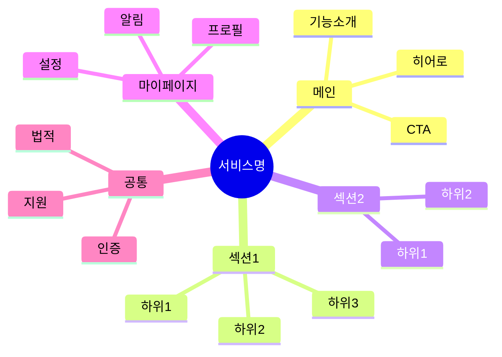
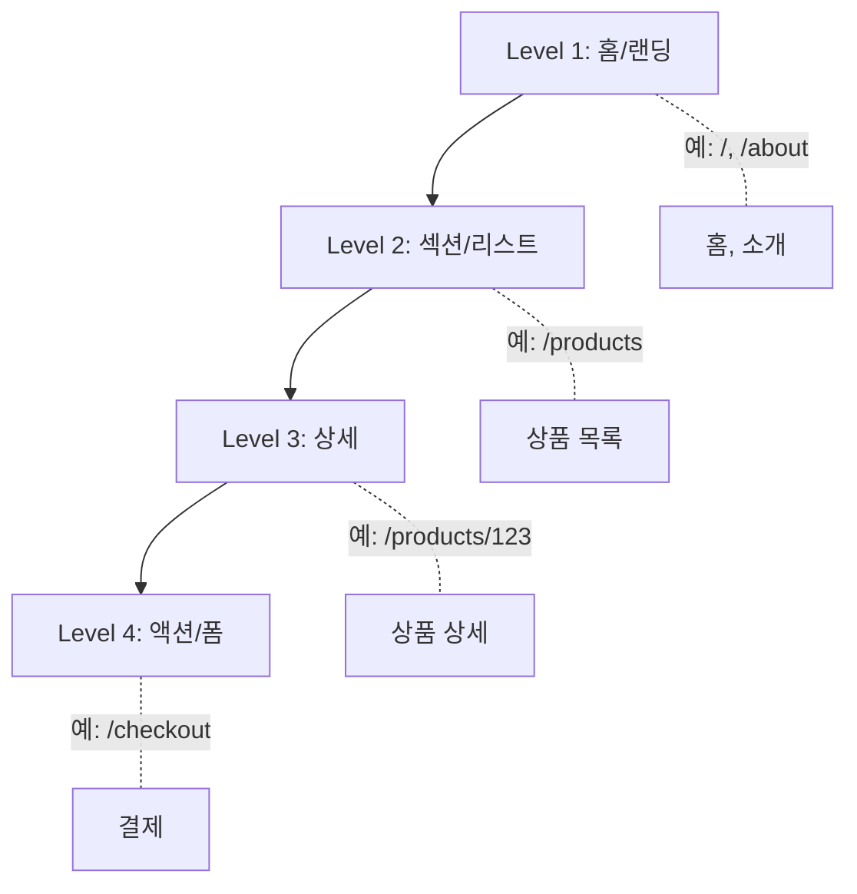
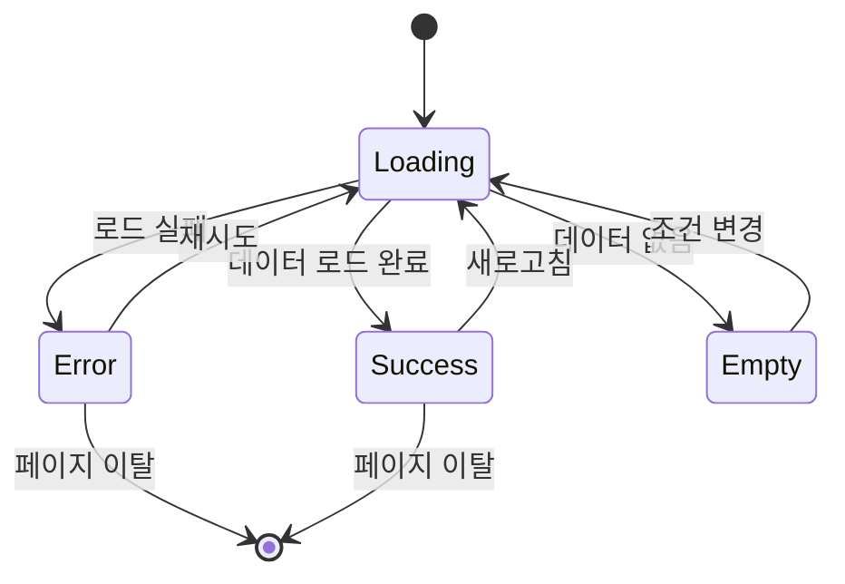
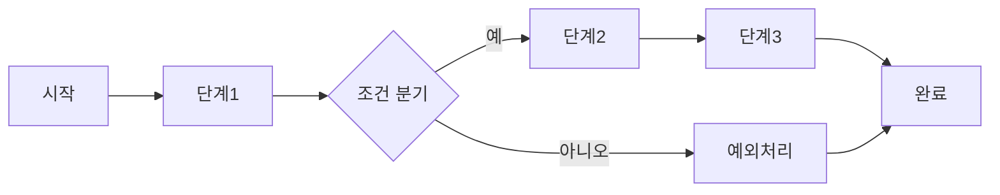
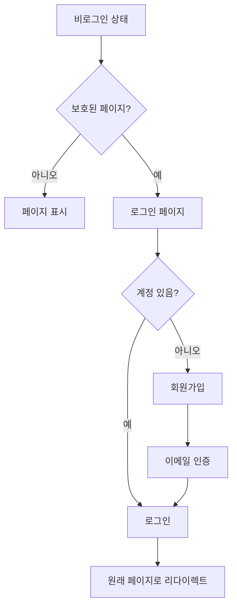
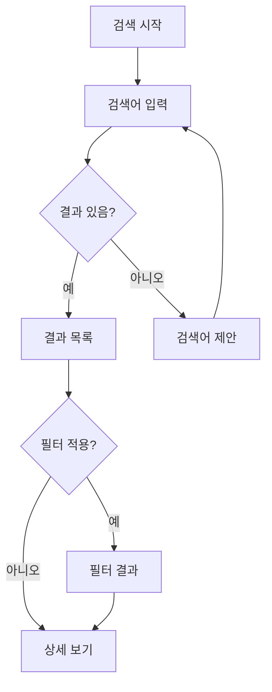

# IA (Information Architecture) 템플릿

## 1. 사이트맵

### 1.1 텍스트 사이트맵

```
홈
├── 메인
│   ├── 히어로 섹션
│   ├── 주요 기능 소개
│   └── CTA
│
├── {섹션1}
│   ├── {하위메뉴1}
│   ├── {하위메뉴2}
│   └── {하위메뉴3}
│
├── {섹션2}
│   ├── {하위메뉴1}
│   └── {하위메뉴2}
│
├── 마이페이지
│   ├── 프로필
│   ├── 설정
│   └── 알림
│
└── 공통
    ├── 로그인/회원가입
    ├── 고객지원
    └── 이용약관
```

### 1.2 Mermaid 사이트맵



---

## 2. 네비게이션 구조

### 2.1 글로벌 네비게이션 (GNB) - 데스크톱

| 메뉴 | 경로 | 설명 | 접근 권한 | 아이콘 |
|------|------|------|----------|--------|
| 홈 | `/` | 메인 페이지 | 전체 | Home |
| {메뉴1} | `/{path}` | {설명} | {권한} | {아이콘} |
| {메뉴2} | `/{path}` | {설명} | {권한} | {아이콘} |
| 마이페이지 | `/mypage` | 사용자 대시보드 | 로그인 | User |

### 2.2 모바일 네비게이션

#### 헤더 (Mobile Header)
| 요소 | 위치 | 동작 |
|------|------|------|
| 햄버거 메뉴 | 좌측 | Drawer 열기 |
| 로고 | 중앙 | 홈으로 이동 |
| 액션 버튼 | 우측 | 검색/알림/장바구니 |

#### Drawer 메뉴 (Mobile Drawer)
```
┌────────────────────┐
│ [X] 닫기           │
├────────────────────┤
│ 👤 사용자명        │
│    user@email.com  │
├────────────────────┤
│ 🏠 홈              │
│ 📁 {섹션1}     [>] │
│ 📁 {섹션2}     [>] │
│ 👤 마이페이지  [>] │
├────────────────────┤
│ ⚙️ 설정            │
│ 🚪 로그아웃        │
└────────────────────┘
```

#### Bottom Navigation (앱/모바일 웹)
| 순서 | 메뉴 | 아이콘 | 경로 |
|------|------|--------|------|
| 1 | 홈 | Home | `/` |
| 2 | 탐색 | Search | `/explore` |
| 3 | {핵심기능} | {아이콘} | `/{path}` |
| 4 | 알림 | Bell (badge) | `/notifications` |
| 5 | 마이 | User | `/mypage` |

### 2.3 로컬 네비게이션 (LNB)

#### {섹션} 하위 메뉴
| 메뉴 | 경로 | 설명 | 상태 표시 |
|------|------|------|----------|
| {하위1} | `/{section}/{sub1}` | {설명} | - |
| {하위2} | `/{section}/{sub2}` | {설명} | NEW 뱃지 |

### 2.4 푸터 네비게이션

| 카테고리 | 링크 |
|----------|------|
| 회사 | 소개, 채용, 블로그, 뉴스 |
| 서비스 | 기능, 요금, 고객사례 |
| 지원 | FAQ, 문의, 가이드, API |
| 법적 | 이용약관, 개인정보처리방침, 쿠키정책 |
| 소셜 | Twitter, Instagram, LinkedIn |

### 2.5 브레드크럼 (Breadcrumb)

| 페이지 레벨 | 브레드크럼 형식 | 예시 |
|------------|----------------|------|
| Level 1 | 홈 | `홈` |
| Level 2 | 홈 > 섹션 | `홈 > 상품` |
| Level 3 | 홈 > 섹션 > 카테고리 | `홈 > 상품 > 전자제품` |
| Level 4 | 홈 > 섹션 > ... > 상세 | `홈 > 상품 > ... > 상품명` |

**브레드크럼 규칙:**
- 3단계 이상 시 중간 단계 축약 (`...`)
- 현재 페이지는 비활성 텍스트로 표시
- 모바일에서는 `< 이전 섹션` 형태로 단순화

---

## 3. 페이지 계층구조

### Level 1 (최상위)
- 홈
- 주요 섹션들
- 마이페이지

### Level 2 (섹션 하위)
- 각 섹션별 리스트/목록 페이지
- 카테고리 페이지

### Level 3 (상세)
- 상세 페이지
- 개별 콘텐츠 페이지

### Level 4 (기능)
- 폼/입력 페이지
- 결과 페이지

### 페이지 계층 다이어그램



---

## 4. URL 구조

### 4.1 기본 URL 패턴

| 페이지 | URL 패턴 | 예시 | HTTP Method |
|--------|----------|------|-------------|
| 메인 | `/` | `/` | GET |
| 리스트 | `/{section}` | `/products` | GET |
| 상세 | `/{section}/[id]` | `/products/123` | GET |
| 생성 | `/{section}/new` | `/products/new` | GET (form) |
| 수정 | `/{section}/[id]/edit` | `/products/123/edit` | GET (form) |
| 검색 | `/search?q={query}` | `/search?q=keyword` | GET |

### 4.2 검색/필터/정렬 URL 구조

```
/products?
  q={검색어}&                    # 검색 키워드
  category={카테고리}&            # 필터: 카테고리
  price_min={최소가}&             # 필터: 최소 가격
  price_max={최대가}&             # 필터: 최대 가격
  sort={정렬기준}&                # 정렬: newest, price_asc, price_desc
  page={페이지번호}&              # 페이지네이션
  limit={개수}                    # 페이지당 개수
```

**예시:**
- `/products?category=electronics&sort=newest&page=1&limit=20`
- `/products?q=laptop&price_min=500&price_max=2000`

### 4.3 페이지네이션 URL 전략

| 방식 | URL 형식 | 사용 케이스 |
|------|----------|-----------|
| 쿼리 파라미터 | `/products?page=2` | 일반 목록 |
| 경로 기반 | `/products/page/2` | SEO 중요 페이지 |
| 커서 기반 | `/products?cursor=abc123` | 무한 스크롤 |

---

## 5. 페이지 상태 관리

### 5.1 페이지 상태 다이어그램



### 5.2 상태별 UI 가이드

| 상태 | UI 요소 | 사용자 액션 |
|------|--------|------------|
| Loading | 스켈레톤 UI / 스피너 | 대기 |
| Success | 실제 콘텐츠 | 정상 이용 |
| Empty | 빈 상태 일러스트 + 안내 | CTA 클릭 |
| Error | 에러 메시지 + 재시도 버튼 | 재시도/뒤로가기 |
| Offline | 오프라인 안내 | 연결 대기 |

### 5.3 상태별 컴포넌트

```
┌─────────────────────────────────┐
│           Loading               │
│  ┌─────┐ ░░░░░░░░░░░░░░░░░░   │
│  │░░░░░│ ░░░░░░░░░░░░░░       │
│  │░░░░░│ ░░░░░░░░░░           │
│  └─────┘                       │
└─────────────────────────────────┘

┌─────────────────────────────────┐
│            Empty                │
│                                 │
│      ┌─────────────┐           │
│      │  📭 Empty   │           │
│      └─────────────┘           │
│    표시할 내용이 없습니다        │
│     [ 새로 만들기 ]             │
└─────────────────────────────────┘

┌─────────────────────────────────┐
│            Error                │
│                                 │
│      ┌─────────────┐           │
│      │  ⚠️ Error   │           │
│      └─────────────┘           │
│    문제가 발생했습니다           │
│     [ 다시 시도 ]              │
└─────────────────────────────────┘
```

---

## 6. 콘텐츠 유형

| 콘텐츠 타입 | 설명 | 예시 | 캐싱 전략 |
|------------|------|------|----------|
| 정적 페이지 | 변경이 적은 고정 콘텐츠 | 소개, 약관 | SSG |
| 동적 리스트 | DB 기반 목록 | 상품 목록 | ISR (60s) |
| 개인화 콘텐츠 | 사용자별 맞춤 | 대시보드 | No Cache |
| 사용자 생성 | 사용자가 작성하는 콘텐츠 | 리뷰, 댓글 | ISR (30s) |
| 시스템 생성 | 자동 생성 콘텐츠 | 알림, 추천 | No Cache |

---

## 7. 사용자 흐름 (User Flow)

### 7.1 주요 플로우: {플로우명}



### 7.2 인증 플로우



### 7.3 검색 플로우



---

## 8. 접근 권한 매트릭스

| 페이지 | 비회원 | 일반회원 | 프리미엄 | 관리자 |
|--------|--------|---------|---------|--------|
| 메인 | ✅ | ✅ | ✅ | ✅ |
| 리스트 | ✅ | ✅ | ✅ | ✅ |
| 상세 | ✅ | ✅ | ✅ | ✅ |
| 생성 | ❌ | ✅ | ✅ | ✅ |
| 수정 | ❌ | 본인만 | 본인만 | ✅ |
| 삭제 | ❌ | 본인만 | 본인만 | ✅ |
| 프리미엄 기능 | ❌ | ❌ | ✅ | ✅ |
| 관리 페이지 | ❌ | ❌ | ❌ | ✅ |

### 권한 없음 시 처리

| 상황 | 처리 방식 |
|------|----------|
| 비로그인 → 보호 페이지 | 로그인 페이지로 리다이렉트 (return URL 포함) |
| 권한 부족 | 403 페이지 + 업그레이드 안내 |
| 본인 외 접근 | 404 페이지 (보안상 존재 여부 숨김) |

---

## 9. 접근성 (Accessibility)

### 9.1 키보드 네비게이션

| 키 | 동작 | 적용 요소 |
|----|------|----------|
| Tab | 다음 포커스 가능 요소로 이동 | 모든 인터랙티브 요소 |
| Shift + Tab | 이전 포커스 가능 요소로 이동 | 모든 인터랙티브 요소 |
| Enter | 활성화/선택 | 버튼, 링크 |
| Space | 활성화/토글 | 체크박스, 버튼 |
| Arrow Keys | 옵션 간 이동 | 드롭다운, 메뉴 |
| Escape | 닫기/취소 | 모달, 드롭다운 |

### 9.2 포커스 순서 (Tab Order)

```
1. Skip to Content 링크
2. 로고/홈 링크
3. GNB 메뉴 (좌→우)
4. 검색 입력
5. 사용자 메뉴
6. 메인 콘텐츠 (위→아래, 좌→우)
7. 사이드바 (있는 경우)
8. 푸터 링크
```

### 9.3 Skip Navigation

```html
<!-- 페이지 최상단 -->
<a href="#main-content" class="skip-link">
  본문으로 바로가기
</a>

<!-- 메인 콘텐츠 -->
<main id="main-content" tabindex="-1">
  ...
</main>
```

### 9.4 ARIA 랜드마크

| 랜드마크 | 역할 | 사용 위치 |
|----------|------|----------|
| banner | 헤더 | `<header>` |
| navigation | 네비게이션 | `<nav>` |
| main | 메인 콘텐츠 | `<main>` |
| complementary | 보조 콘텐츠 | `<aside>` |
| contentinfo | 푸터 | `<footer>` |
| search | 검색 | 검색 폼 |

---

## 10. SEO 고려사항

### 10.1 페이지별 메타 구조

| 페이지 | Title 패턴 | Description | Keywords |
|--------|-----------|-------------|----------|
| 메인 | {서비스명} - {슬로건} | {서비스 설명 155자} | {핵심 키워드} |
| 리스트 | {카테고리} \| {서비스명} | {카테고리 설명} | {카테고리 관련} |
| 상세 | {제목} \| {서비스명} | {요약 설명} | {콘텐츠 관련} |
| 검색 | {검색어} 검색 결과 \| {서비스명} | - | - |

### 10.2 Canonical URL

```html
<!-- 기본 페이지 -->
<link rel="canonical" href="https://example.com/products" />

<!-- 페이지네이션 (첫 페이지를 canonical로) -->
<link rel="canonical" href="https://example.com/products" />

<!-- 필터/정렬 적용 페이지 -->
<link rel="canonical" href="https://example.com/products" />
```

### 10.3 구조화 데이터 (Schema.org)

| 페이지 | Schema Type | 필수 필드 |
|--------|-------------|----------|
| 메인 | Organization | name, url, logo |
| 상품 | Product | name, price, availability |
| 블로그 | Article | headline, author, datePublished |
| FAQ | FAQPage | question, answer |
| 리뷰 | Review | reviewRating, author |

### 10.4 Open Graph / Twitter Card

```html
<!-- Open Graph -->
<meta property="og:title" content="{제목}" />
<meta property="og:description" content="{설명}" />
<meta property="og:image" content="{이미지 URL}" />
<meta property="og:url" content="{페이지 URL}" />
<meta property="og:type" content="website" />

<!-- Twitter Card -->
<meta name="twitter:card" content="summary_large_image" />
<meta name="twitter:title" content="{제목}" />
<meta name="twitter:description" content="{설명}" />
<meta name="twitter:image" content="{이미지 URL}" />
```

---

## 11. 마이크로인터랙션 상태

### 11.1 인터랙티브 요소 상태

| 상태 | 설명 | 시각적 변화 |
|------|------|-----------|
| Default | 기본 상태 | - |
| Hover | 마우스 오버 | 배경색 변화, 커서 변경 |
| Focus | 키보드 포커스 | 아웃라인 표시 |
| Active | 클릭 중 | 스케일 축소, 색상 변화 |
| Disabled | 비활성화 | 투명도 감소, 커서 변경 |
| Loading | 로딩 중 | 스피너 표시, 클릭 불가 |

### 11.2 폼 필드 상태

| 상태 | 테두리 색상 | 아이콘/메시지 |
|------|-----------|-------------|
| Default | Gray-300 | - |
| Focus | Primary | - |
| Valid | Success | ✓ 체크 아이콘 |
| Invalid | Error | ✗ + 에러 메시지 |
| Disabled | Gray-200 | - |

---

## 12. 관련 문서

| 문서 | 링크 | 설명 |
|------|------|------|
| PRD | {링크} | 기능 요구사항 |
| 사용자 여정 | {링크} | 페르소나별 여정 |
| 디자인 가이드 | {링크} | 컴포넌트 스펙 |
| TRD | {링크} | 기술 명세 |
