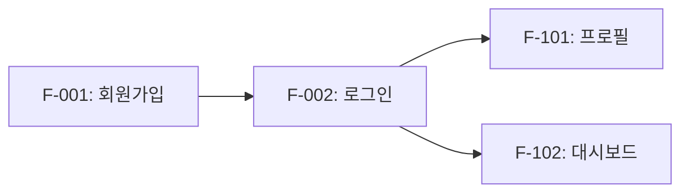
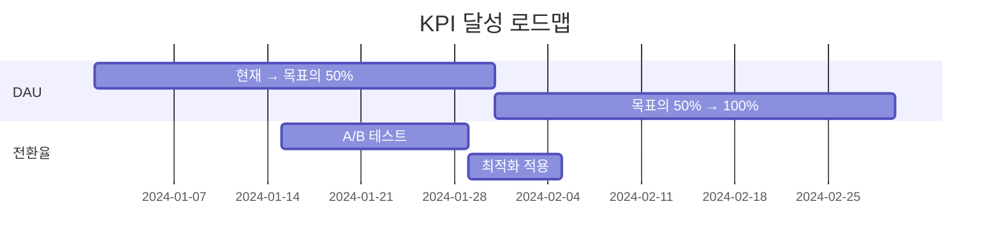

# PRD (Product Requirements Document) 템플릿

## 1. 개요

### 1.1 문서 정보
| 항목 | 내용 |
|------|------|
| 프로젝트명 | {project_name} |
| 버전 | 1.0 |
| 작성일 | {date} |
| 작성자 | {author} |
| 상태 | Draft / Review / Approved |

### 1.2 제품 요약
{1-2문장으로 제품을 설명}

### 1.3 배경 및 목적
- **문제 정의**: {해결하려는 문제}
- **목적**: {제품의 목적}
- **기대 효과**: {예상되는 결과}

### 1.4 스테이크홀더 승인

| 역할 | 이름 | 승인일 | 서명 |
|------|------|--------|------|
| Product Owner | {이름} | | [ ] |
| Tech Lead | {이름} | | [ ] |
| Design Lead | {이름} | | [ ] |
| QA Lead | {이름} | | [ ] |

---

## 2. 목표

### 2.1 비즈니스 목표
| 목표 | 지표 | 현재값 | 목표치 | 기한 |
|------|------|--------|--------|------|
| {목표1} | {측정 지표} | {현재} | {목표} | {기한} |
| {목표2} | {측정 지표} | {현재} | {목표} | {기한} |

### 2.2 사용자 목표
- {사용자가 달성하고자 하는 것}

### 2.3 비목표 (Out of Scope)
- {이 버전에서 다루지 않는 것}
- {의도적으로 배제한 기능과 그 이유}

---

## 3. 타겟 사용자

### 3.1 주요 페르소나
| 구분 | 페르소나 A | 페르소나 B |
|------|-----------|-----------|
| 이름 | {가상의 이름} | {가상의 이름} |
| 연령대 | {범위} | {범위} |
| 직업/역할 | {설명} | {설명} |
| 주요 니즈 | {설명} | {설명} |
| Pain Point | {설명} | {설명} |

### 3.2 사용자 세그먼트
1. **{세그먼트1}**: {설명} - 예상 비율: 

### 3.3 페르소나별 기능 맵핑

| 기능 ID | 기능명 | 페르소나 A | 페르소나 B | 우선순위 |
|---------|--------|-----------|-----------|----------|
| F-001 | {기능명} | ● 핵심 | ○ 부가 | P0 |
| F-002 | {기능명} | ○ 부가 | ● 핵심 | P0 |
| F-101 | {기능명} | - 불필요 | ● 핵심 | P1 |

> ● 핵심: 해당 페르소나에게 필수 기능
> ○ 부가: 있으면 좋은 기능
> - 불필요: 해당 페르소나에게 불필요

---

## 4. 기능 요구사항

### 4.1 핵심 기능 (Must Have)
| ID | 기능명 | 설명 | 수용 기준 | 예상 공수 | 우선순위 |
|----|--------|------|----------|----------|----------|
| F-001 | {기능명} | {설명} | {완료 조건} | {일} | P0 |
| F-002 | {기능명} | {설명} | {완료 조건} | {일} | P0 |

### 4.2 부가 기능 (Should Have)
| ID | 기능명 | 설명 | 수용 기준 | 예상 공수 | 우선순위 |
|----|--------|------|----------|----------|----------|
| F-101 | {기능명} | {설명} | {완료 조건} | {일} | P1 |

### 4.3 선택 기능 (Nice to Have)
| ID | 기능명 | 설명 | 수용 기준 | 예상 공수 | 우선순위 |
|----|--------|------|----------|----------|----------|
| F-201 | {기능명} | {설명} | {완료 조건} | {일} | P2 |

### 4.4 기능 의존성


---

## 5. 비기능 요구사항

### 5.1 성능 (Performance)
| 항목 | 목표 | 측정 방법 |
|------|------|----------|
| 페이지 로딩 (LCP) | < 2.5초 | Lighthouse |
| API 응답 시간 | < 200ms | 서버 로그 |
| 동시 접속자 | {목표 수} | 부하 테스트 |
| Time to Interactive | < 3초 | Lighthouse |

### 5.2 확장성 (Scalability)
- **수평 확장**: {오토스케일링 정책}
- **데이터 증가**: 월간 {예상} 레코드 증가 대응
- **트래픽 증가**: 피크 트래픽 {배수}배 대응

### 5.3 보안 (Security)
| 항목 | 요구사항 |
|------|----------|
| 인증 | {OAuth2.0 / JWT / Session} |
| 암호화 | 전송: TLS 1.3, 저장: AES-256 |
| 비밀번호 | bcrypt, 최소 8자, 복잡도 규칙 |
| 세션 관리 | 만료 시간: {시간}, 동시 세션: {수} |
| OWASP Top 10 | 모든 항목 대응 필수 |

### 5.4 접근성 (Accessibility)
- WCAG 준수 수준: {AA / AAA}
- 키보드 네비게이션 지원
- 스크린 리더 호환
- 색상 대비 4.5:1 이상

### 5.5 유지보수성 (Maintainability)
- 코드 커버리지: 최소 {%}
- 문서화: API 문서, 컴포넌트 문서
- 모니터링: 에러 추적, 성능 모니터링

### 5.6 규정 준수 (Compliance)
| 규정 | 요구사항 | 대응 방안 |
|------|----------|----------|
| 개인정보보호법 | 개인정보 수집/이용 동의 | 동의 UI, 동의 이력 저장 |
| GDPR (해당 시) | 데이터 삭제권, 이동권 | 계정 삭제 기능, 데이터 내보내기 |
| 저작권법 | 콘텐츠 저작권 표시 | 출처 표시, 라이선스 명시 |

---

## 6. 성공 지표 (KPI)

| 지표 | 현재 | 목표 | 측정 방법 | 측정 도구 | 담당자 | 측정 주기 |
|------|------|------|----------|----------|--------|----------|
| DAU | {현재값} | {목표값} | 일간 활성 사용자 집계 | GA4 | {담당} | 일간 |
| 전환율 | {현재값} | {목표값} | 가입 → 구매 비율 | Mixpanel | {담당} | 주간 |
| NPS | {현재값} | {목표값} | 분기별 설문조사 | Typeform | {담당} | 분기 |
| 이탈률 | {현재값} | {목표값} | 페이지 이탈 비율 | GA4 | {담당} | 주간 |

### 6.1 성공 기준 달성 계획


---

## 7. 제약 사항

### 7.1 기술적 제약
- {기술 스택 제한: 예) React/Next.js만 사용}
- {인프라 제한: 예) AWS 서울 리전만 사용}
- {통합 제한: 예) 레거시 API와 호환 필요}

### 7.2 비즈니스 제약
- {예산: 월 {금액} 이내}
- {인력: 개발 {n}명, 디자인 {n}명}
- {외부 의존성: {서드파티 서비스}}

### 7.3 일정 제약
- MVP 출시: {날짜} (협상 불가)
- 베타 테스트: {날짜} ~ {날짜}
- 정식 출시: {날짜}

### 7.4 법적 제약
- {라이선스 제한}
- {지역 제한}

---

## 8. 위험 분석 (Risk Assessment)

| ID | 위험 요소 | 발생 가능성 | 영향도 | 위험 수준 | 대응 전략 | 담당자 |
|----|----------|-----------|-------|----------|----------|--------|
| R-001 | {위험1} | 높음/중간/낮음 | 높음/중간/낮음 | 🔴/🟡/🟢 | {대응 방안} | {담당} |
| R-002 | {위험2} | 높음/중간/낮음 | 높음/중간/낮음 | 🔴/🟡/🟢 | {대응 방안} | {담당} |

### 8.1 위험 수준 매트릭스
```
           영향도
         낮음  중간  높음
발생  높음  🟡    🟡    🔴
가능성 중간  🟢    🟡    🟡
      낮음  🟢    🟢    🟡
```

### 8.2 대응 계획
- **🔴 높음**: 즉시 대응, 주간 모니터링
- **🟡 중간**: 대응 계획 수립, 격주 모니터링
- **🟢 낮음**: 인지, 월간 모니터링

---

## 9. 의사결정 기록 (Decision Log)

| ID | 날짜 | 결정 사항 | 배경 | 대안 | 선택 이유 | 결정자 |
|----|------|----------|------|------|----------|--------|
| D-001 | {날짜} | {결정 내용} | {왜 결정이 필요했는지} | {고려한 대안들} | {이 선택을 한 이유} | {결정자} |
| D-002 | {날짜} | {결정 내용} | {왜 결정이 필요했는지} | {고려한 대안들} | {이 선택을 한 이유} | {결정자} |

### 9.1 미결정 사항
| ID | 사항 | 결정 필요일 | 담당자 | 상태 |
|----|------|-----------|--------|------|
| P-001 | {미결정 사항} | {날짜} | {담당} | 검토 중 |

---

## 10. 릴리즈 계획

### 10.1 릴리즈 일정

| 버전 | 포함 기능 | 예정일 | 의존성 |
|------|----------|--------|--------|
| MVP | F-001, F-002 | {날짜} | 없음 |
| v1.1 | F-101, F-102 | {날짜} | MVP 완료 |
| v1.2 | F-201 | {날짜} | v1.1 완료 |

### 10.2 릴리즈 체크리스트
- [ ] 기능 개발 완료
- [ ] QA 테스트 통과
- [ ] 성능 테스트 통과
- [ ] 보안 점검 완료
- [ ] 문서화 완료
- [ ] 스테이크홀더 최종 승인

---

## 11. 관련 문서

| 문서 | 링크 | 설명 |
|------|------|------|
| 사용자 여정 | {링크} | 페르소나별 사용자 여정 맵 |
| IA | {링크} | 정보 구조 및 사이트맵 |
| ERD | {링크} | 데이터베이스 설계 |
| TRD | {링크} | 기술 요구사항 |
| 디자인 가이드 | {링크} | UI/UX 디자인 시스템 |

---

## 변경 이력

| 버전 | 날짜 | 변경 내용 | 작성자 | 검토자 |
|------|------|----------|--------|--------|
| 1.0 | {date} | 최초 작성 | {author} | {reviewer} |
| 1.1 | {date} | {변경 내용} | {author} | {reviewer} |
