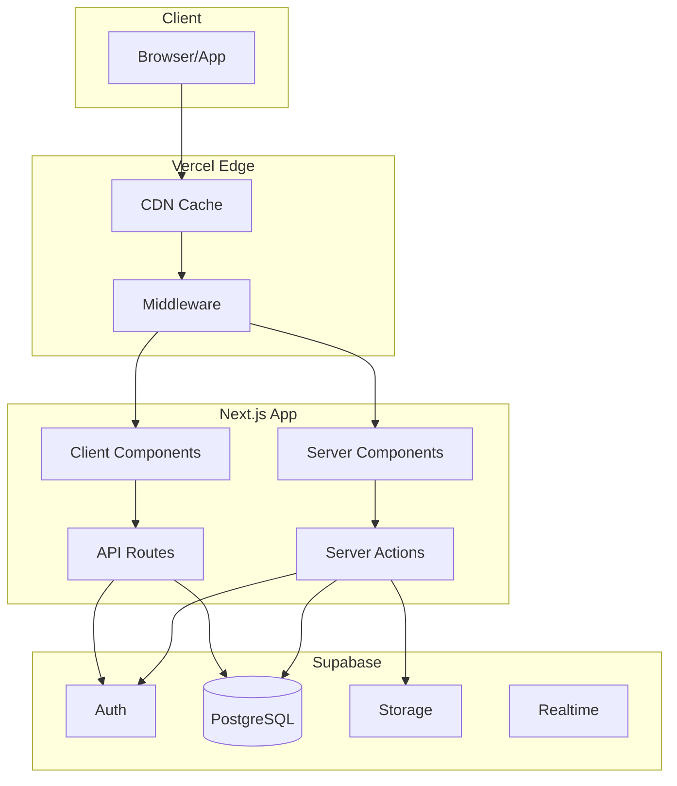
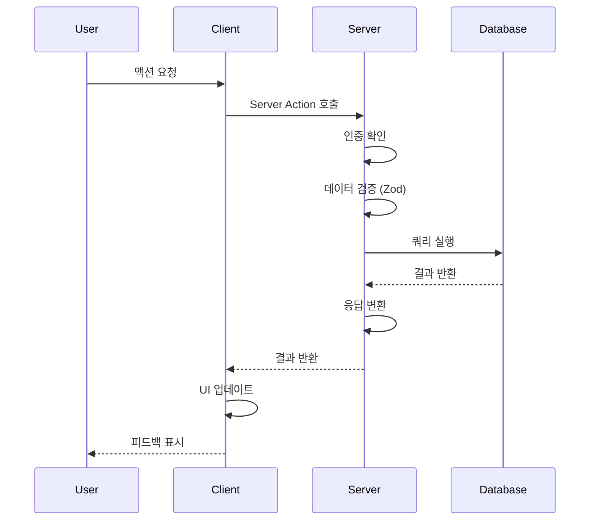
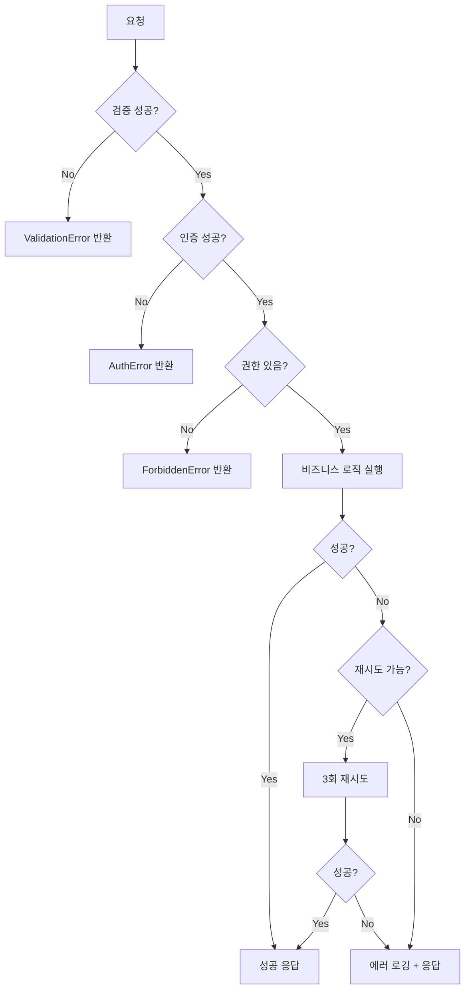
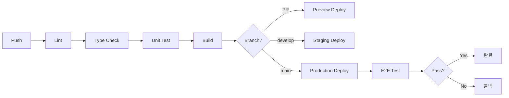

# TRD (Technical Requirements Document) 템플릿

## 1. 기술 스택

> **⚠️ 작성 지침**: 아래 테이블의 `{latest}` 자리에는 **context7 MCP 도구**로 조회한 **최신 안정(stable) 버전**을 기입한다.
> 메이저 버전 변경이 있으면 **섹션 끝에 breaking changes를 별도로 정리**한다.

### 1.1 프론트엔드

| 기술 | 버전 | 용도 | 선택 이유 |
|------|------|------|----------|
| Next.js | {latest} | 프레임워크 | App Router, RSC 지원 |
| React | {latest} | UI 라이브러리 | Next.js 호환 버전 |
| TypeScript | {latest} | 타입 시스템 | 타입 안정성, DX 향상 |
| Tailwind CSS | {latest} | 스타일링 | 유틸리티 기반, 빠른 개발 |
| shadcn/ui | - | UI 컴포넌트 | 커스터마이징 용이, 접근성 |
| Zustand | {latest} | 상태관리 | 간단한 API, 번들 크기 |
| TanStack Query | {latest} | 서버 상태 | 캐싱, 재검증, 에러 처리 |
| React Hook Form | {latest} | 폼 관리 | 비제어 컴포넌트, 성능 |
| Zod | {latest} | 검증 | 타입 추론, 런타임 검증 |
| Recharts | {latest} | 차트 | React 네이티브, 선언형 |

### 1.2 백엔드

| 기술 | 버전 | 용도 | 선택 이유 |
|------|------|------|----------|
| Node.js | {latest LTS} | 런타임 | LTS, Next.js 호환 |
| Supabase | - | BaaS | PostgreSQL, Auth, Storage 통합 |

### 1.3 인프라

| 기술 | 용도 | 선택 이유 |
|------|------|----------|
| Vercel | 호스팅 | Next.js 최적화, Edge 지원 |
| Supabase | DB/Auth/Storage | 통합 솔루션, 무료 티어 |
| Cloudflare | CDN/DNS | 글로벌 캐싱, DDoS 방어 |

### 1.4 개발 도구

| 기술 | 버전 | 용도 |
|------|------|------|
| ESLint | {latest} | 린팅 |
| Prettier | {latest} | 포맷팅 |
| Vitest | {latest} | 테스팅 |
| Playwright | {latest} | E2E 테스트 |
| Husky | {latest} | Git Hooks |
| pnpm | {latest} | 패키지 매니저 |

---

## 2. 시스템 아키텍처

### 2.1 전체 구조



### 2.2 데이터 흐름



### 2.3 캐싱 레이어

```
┌─────────────────────────────────────────────────────┐
│ Layer 1: Browser Cache (HTTP Cache Headers)         │
├─────────────────────────────────────────────────────┤
│ Layer 2: CDN Cache (Vercel Edge, Cloudflare)        │
├─────────────────────────────────────────────────────┤
│ Layer 3: Server Cache (React Cache, ISR)            │
├─────────────────────────────────────────────────────┤
│ Layer 4: Database Cache (Connection Pool)           │
└─────────────────────────────────────────────────────┘
```

---

## 3. API 설계

### 3.1 API 엔드포인트

| Method | Endpoint | 설명 | 인증 | Rate Limit |
|--------|----------|------|------|------------|
| GET | `/api/{resource}` | 목록 조회 | 선택 | 100/min |
| GET | `/api/{resource}/[id]` | 상세 조회 | 선택 | 100/min |
| POST | `/api/{resource}` | 생성 | 필수 | 30/min |
| PATCH | `/api/{resource}/[id]` | 수정 | 필수 | 30/min |
| DELETE | `/api/{resource}/[id]` | 삭제 | 필수 | 10/min |

### 3.2 요청/응답 형식

#### 성공 응답

```typescript
interface SuccessResponse<T> {
  success: true
  data: T
  meta?: {
    page: number
    limit: number
    total: number
    hasMore: boolean
  }
}
```

```json
{
  "success": true,
  "data": { ... },
  "meta": {
    "page": 1,
    "limit": 10,
    "total": 100,
    "hasMore": true
  }
}
```

#### 에러 응답

```typescript
interface ErrorResponse {
  success: false
  error: {
    code: string
    message: string
    details?: Record<string, string[]> // 검증 에러
  }
}
```

```json
{
  "success": false,
  "error": {
    "code": "VALIDATION_ERROR",
    "message": "입력값이 올바르지 않습니다",
    "details": {
      "email": ["유효한 이메일 형식이 아닙니다"],
      "password": ["최소 8자 이상이어야 합니다"]
    }
  }
}
```

### 3.3 에러 코드

| 코드 | HTTP Status | 설명 | 사용자 메시지 |
|------|-------------|------|--------------|
| UNAUTHORIZED | 401 | 인증 필요 | 로그인이 필요합니다 |
| FORBIDDEN | 403 | 권한 없음 | 접근 권한이 없습니다 |
| NOT_FOUND | 404 | 리소스 없음 | 요청한 데이터를 찾을 수 없습니다 |
| VALIDATION_ERROR | 400 | 유효성 검사 실패 | 입력값을 확인해주세요 |
| CONFLICT | 409 | 중복 데이터 | 이미 존재하는 데이터입니다 |
| RATE_LIMITED | 429 | 요청 제한 | 잠시 후 다시 시도해주세요 |
| INTERNAL_ERROR | 500 | 서버 오류 | 일시적인 오류가 발생했습니다 |

---

## 4. 인증/인가

### 4.1 인증 방식

| 방식 | 사용 케이스 | 구현 |
|------|-----------|------|
| 이메일/비밀번호 | 기본 로그인 | Supabase Auth |
| OAuth 2.0 | 소셜 로그인 | Google, GitHub |
| Magic Link | 비밀번호 없는 로그인 | Supabase Auth |

### 4.2 세션 관리

```typescript
// 세션 설정
const supabase = createClient({
  auth: {
    autoRefreshToken: true,
    persistSession: true,
    detectSessionInUrl: true,
    flowType: 'pkce'
  }
})
```

| 설정 | 값 | 설명 |
|------|-----|------|
| Access Token 만료 | 1시간 | 자동 갱신 |
| Refresh Token 만료 | 7일 | 로그인 유지 |
| 동시 세션 | 제한 없음 | 기기별 세션 |

### 4.3 인가 레벨

| 역할 | 권한 | 접근 가능 페이지 |
|------|------|-----------------|
| 비회원 | 공개 콘텐츠 조회 | 홈, 공개 목록, 상세 |
| 회원 | 본인 데이터 CRUD | + 마이페이지, 생성/수정 |
| 프리미엄 | 프리미엄 기능 | + 고급 기능 |
| 관리자 | 전체 데이터 관리 | + 관리자 페이지 |

### 4.4 미들웨어 설정

```typescript
// middleware.ts
import { createMiddlewareClient } from '@supabase/auth-helpers-nextjs'
import { NextResponse } from 'next/server'
import type { NextRequest } from 'next/server'

export async function middleware(req: NextRequest) {
  const res = NextResponse.next()
  const supabase = createMiddlewareClient({ req, res })

  const { data: { session } } = await supabase.auth.getSession()

  // 보호된 경로 체크
  const protectedPaths = ['/dashboard', '/settings', '/admin']
  const isProtected = protectedPaths.some(p => req.nextUrl.pathname.startsWith(p))

  if (isProtected && !session) {
    const redirectUrl = new URL('/login', req.url)
    redirectUrl.searchParams.set('redirectTo', req.nextUrl.pathname)
    return NextResponse.redirect(redirectUrl)
  }

  return res
}

export const config = {
  matcher: ['/dashboard/:path*', '/settings/:path*', '/admin/:path*']
}
```

---

## 5. 캐싱 전략

### 5.1 서버 캐싱 (Next.js)

| 전략 | 사용 케이스 | 설정 |
|------|-----------|------|
| Static (SSG) | 정적 페이지 | 빌드 시 생성 |
| ISR | 자주 변경되지 않는 데이터 | `revalidate: 60` |
| Dynamic | 개인화 데이터 | `dynamic: 'force-dynamic'` |

```typescript
// ISR 예시
async function getPost(slug: string) {
  const post = await fetchPost(slug)
  return post
}

// 페이지에서 사용
export const revalidate = 60 // 60초마다 재검증

// On-Demand Revalidation
// POST /api/revalidate?path=/posts/[slug]&secret=xxx
export async function POST(request: Request) {
  const { path } = await request.json()
  revalidatePath(path)
  return Response.json({ revalidated: true })
}
```

### 5.2 클라이언트 캐싱 (React Query)

```typescript
const queryClient = new QueryClient({
  defaultOptions: {
    queries: {
      staleTime: 1000 * 60 * 5,      // 5분간 fresh
      gcTime: 1000 * 60 * 30,        // 30분간 캐시 유지
      retry: 3,
      refetchOnWindowFocus: false,
    },
  },
})

// 쿼리별 설정
const { data } = useQuery({
  queryKey: ['posts', { page, status }],
  queryFn: () => fetchPosts({ page, status }),
  staleTime: 1000 * 60 * 1, // 1분
})
```

### 5.3 HTTP 캐시 헤더

```typescript
// API Route
export async function GET() {
  const data = await fetchData()

  return Response.json(data, {
    headers: {
      'Cache-Control': 'public, s-maxage=60, stale-while-revalidate=300'
    }
  })
}
```

---

## 6. 에러 처리

### 6.1 에러 처리 플로우



### 6.2 에러 클래스

```typescript
// lib/errors.ts
export class AppError extends Error {
  constructor(
    public code: string,
    public message: string,
    public statusCode: number = 500,
    public details?: Record<string, string[]>
  ) {
    super(message)
  }
}

export class ValidationError extends AppError {
  constructor(details: Record<string, string[]>) {
    super('VALIDATION_ERROR', '입력값이 올바르지 않습니다', 400, details)
  }
}

export class NotFoundError extends AppError {
  constructor(resource: string) {
    super('NOT_FOUND', `${resource}을(를) 찾을 수 없습니다`, 404)
  }
}
```

### 6.3 전역 에러 핸들러

```typescript
// app/error.tsx
'use client'

export default function Error({
  error,
  reset,
}: {
  error: Error & { digest?: string }
  reset: () => void
}) {
  return (
    <div className="flex flex-col items-center justify-center min-h-screen">
      <h2>문제가 발생했습니다</h2>
      <p>{error.message}</p>
      <button onClick={reset}>다시 시도</button>
    </div>
  )
}
```

---

## 7. 성능 요구사항

### 7.1 Core Web Vitals 목표

| 지표 | 목표 | 측정 방법 | 현재 |
|------|------|----------|------|
| LCP | < 2.5s | Lighthouse | - |
| FID/INP | < 100ms | Lighthouse | - |
| CLS | < 0.1 | Lighthouse | - |
| TTFB | < 200ms | 서버 로그 | - |

### 7.2 성능 최적화 전략

| 영역 | 전략 | 구현 |
|------|------|------|
| 이미지 | next/image + WebP | `<Image />` 컴포넌트 |
| 폰트 | next/font + subset | 한글 subset 적용 |
| 번들 | 코드 스플리팅 | `dynamic()` import |
| JS | Tree Shaking | ES Modules 사용 |
| CSS | Tailwind purge | 프로덕션 빌드 자동 |
| API | 응답 압축 | gzip/brotli |

### 7.3 번들 크기 목표

| 구분 | 목표 | 측정 |
|------|------|------|
| First Load JS | < 100KB | `next build` 출력 |
| 페이지별 JS | < 50KB | `next build` 출력 |
| 총 번들 크기 | < 300KB | 번들 분석기 |

---

## 8. 보안 요구사항

### 8.1 보안 체크리스트

- [x] HTTPS 강제 (Vercel 기본)
- [ ] CORS 설정
- [ ] Rate Limiting
- [ ] SQL Injection 방지 (Supabase Prepared Statement)
- [ ] XSS 방지 (React 기본 이스케이프)
- [ ] CSRF 방지 (Server Actions SameSite Cookie)
- [ ] 환경 변수 관리

### 8.2 환경 변수 관리

```bash
# .env.local (로컬 개발 - gitignore)
NEXT_PUBLIC_SUPABASE_URL=https://xxx.supabase.co
NEXT_PUBLIC_SUPABASE_ANON_KEY=xxx
SUPABASE_SERVICE_ROLE_KEY=xxx  # 서버 전용

# .env.example (버전 관리)
NEXT_PUBLIC_SUPABASE_URL=
NEXT_PUBLIC_SUPABASE_ANON_KEY=
SUPABASE_SERVICE_ROLE_KEY=
```

| 변수 | 공개 여부 | 설명 |
|------|----------|------|
| `NEXT_PUBLIC_*` | 클라이언트 노출 | 공개 API 키 |
| 그 외 | 서버 전용 | 비밀 키 |

### 8.3 민감 데이터 처리

| 데이터 | 저장 방식 | 접근 제한 |
|--------|----------|----------|
| 비밀번호 | Supabase Auth 해싱 | 복호화 불가 |
| API 키 | 환경 변수 | 서버 전용 |
| 개인정보 | DB (RLS 적용) | 본인만 |
| 파일 | Supabase Storage | 인증된 URL |

---

## 9. 배포 전략

### 9.1 환경 구성

| 환경 | URL | 브랜치 | 용도 |
|------|-----|--------|------|
| Development | localhost:3000 | - | 로컬 개발 |
| Preview | *.vercel.app | PR 브랜치 | PR 미리보기 |
| Staging | staging.{domain} | develop | QA 테스트 |
| Production | {domain} | main | 운영 |

### 9.2 DB 환경 분리

> **⚠️ 필수**: 개발과 프로덕션 DB는 반드시 분리한다. 같은 DB를 공유하면 개발 중 실수로 고객 데이터를 삭제/오염시킬 수 있다.

#### 환경별 DB 매핑

| 환경 | Supabase 프로젝트 | 용도 | 데이터 |
|------|------------------|------|--------|
| Development | {project}-dev | 로컬 개발, 실험 | 더미/시드 데이터 |
| Preview/Staging | {project}-dev | PR 테스트, QA | 더미/시드 데이터 |
| Production | {project}-prod | 실제 서비스 | 고객 데이터 |

#### 환경변수 설정

```bash
# .env.local (개발용 — 개발 DB를 가리킴)
NEXT_PUBLIC_SUPABASE_URL=https://{project-dev}.supabase.co
NEXT_PUBLIC_SUPABASE_ANON_KEY={dev-anon-key}

# Vercel Production 환경변수 (프로덕션 DB를 가리킴)
NEXT_PUBLIC_SUPABASE_URL=https://{project-prod}.supabase.co
NEXT_PUBLIC_SUPABASE_ANON_KEY={prod-anon-key}
```

#### 분리 원칙

1. **프로젝트 분리**: Supabase 프로젝트를 dev/prod 최소 2개 생성
2. **스키마 동기화**: 마이그레이션 파일로 스키마를 관리하여 환경 간 동기화
3. **시드 데이터**: 개발 DB에는 시드 스크립트로 테스트 데이터 투입
4. **접근 제한**: 프로덕션 DB의 Service Role Key는 CI/CD 환경에서만 사용

### 9.2 CI/CD 파이프라인



### 9.3 GitHub Actions 예시

```yaml
# .github/workflows/ci.yml
name: CI

on:
  push:
    branches: [main, develop]
  pull_request:
    branches: [main, develop]

jobs:
  test:
    runs-on: ubuntu-latest
    steps:
      - uses: actions/checkout@v4
      - uses: pnpm/action-setup@v2
      - uses: actions/setup-node@v4
        with:
          node-version: 20
          cache: 'pnpm'

      - run: pnpm install
      - run: pnpm lint
      - run: pnpm typecheck
      - run: pnpm test
      - run: pnpm build
```

### 9.4 롤백 전략

| 상황 | 대응 |
|------|------|
| UI 버그 | Vercel 즉시 롤백 (1분 이내) |
| API 에러 | 이전 배포로 롤백 |
| DB 스키마 | 롤백 마이그레이션 실행 |
| 긴급 상황 | 점검 페이지 활성화 |

---

## 10. Feature Flag

### 10.1 구현 방식

```typescript
// lib/features.ts
const features = {
  newDashboard: process.env.FEATURE_NEW_DASHBOARD === 'true',
  darkMode: true,
  betaFeatures: process.env.NODE_ENV === 'development',
} as const

export function isFeatureEnabled(feature: keyof typeof features): boolean {
  return features[feature] ?? false
}

// 사용
if (isFeatureEnabled('newDashboard')) {
  return <NewDashboard />
}
```

### 10.2 환경별 설정

| Feature | Development | Staging | Production |
|---------|-------------|---------|------------|
| newDashboard | ✅ | ✅ | ❌ |
| darkMode | ✅ | ✅ | ✅ |
| betaFeatures | ✅ | ❌ | ❌ |

---

## 11. 모니터링

### 11.1 로깅 전략

| 레벨 | 환경 | 예시 |
|------|------|------|
| debug | dev only | 변수 값, 흐름 추적 |
| info | all | 요청/응답, 이벤트 |
| warn | all | 비정상 동작 (복구 가능) |
| error | all | 에러 (복구 불가) |

```typescript
// lib/logger.ts
export const logger = {
  debug: (msg: string, data?: object) => {
    if (process.env.NODE_ENV === 'development') {
      console.debug(`[DEBUG] ${msg}`, data)
    }
  },
  info: (msg: string, data?: object) => {
    console.info(`[INFO] ${msg}`, data)
  },
  error: (msg: string, error: Error) => {
    console.error(`[ERROR] ${msg}`, error)
    // TODO: Sentry 연동
  },
}
```

### 11.2 모니터링 도구

| 도구 | 용도 | 설정 |
|------|------|------|
| Vercel Analytics | 성능 모니터링 | 기본 활성화 |
| Sentry | 에러 추적 | 추후 연동 |
| Supabase Dashboard | DB 모니터링 | 기본 제공 |

### 11.3 알림 설정

| 조건 | 채널 | 임계치 |
|------|------|--------|
| 에러율 증가 | Slack | > 1% |
| 응답 시간 증가 | Email | > 3초 |
| 서버 다운 | SMS | 즉시 |

---

## 12. 기술 부채 추적

| ID | 항목 | 영향도 | 해결 계획 |
|----|------|--------|----------|
| TD-001 | {기술 부채1} | 높음/중간/낮음 | {계획} |
| TD-002 | {기술 부채2} | 높음/중간/낮음 | {계획} |

---

## 13. 관련 문서

| 문서 | 링크 | 설명 |
|------|------|------|
| PRD | {링크} | 기능 요구사항 |
| ERD | {링크} | 데이터베이스 설계 |
| API 문서 | {링크} | Swagger/OpenAPI |
| 디자인 가이드 | {링크} | UI 컴포넌트 스펙 |
