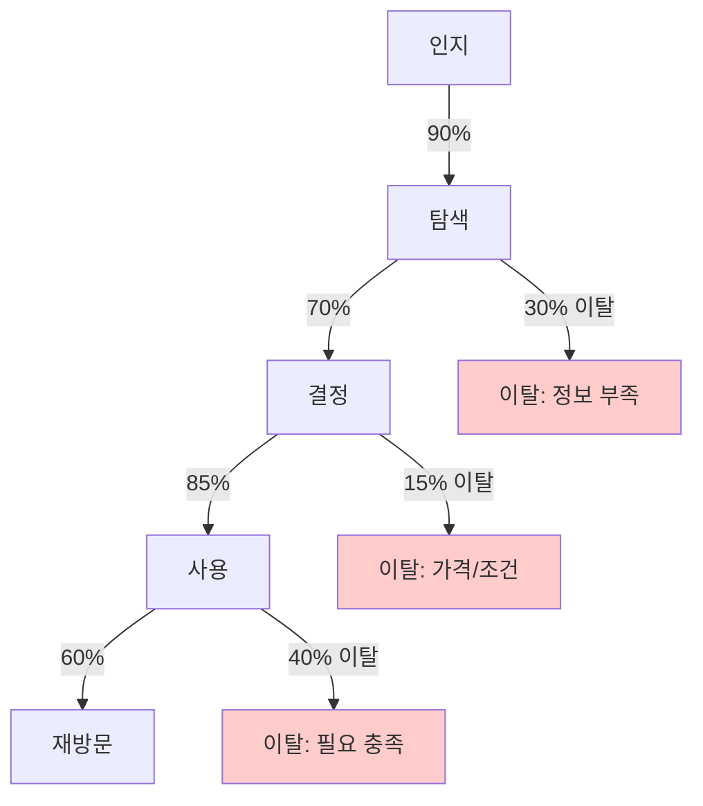
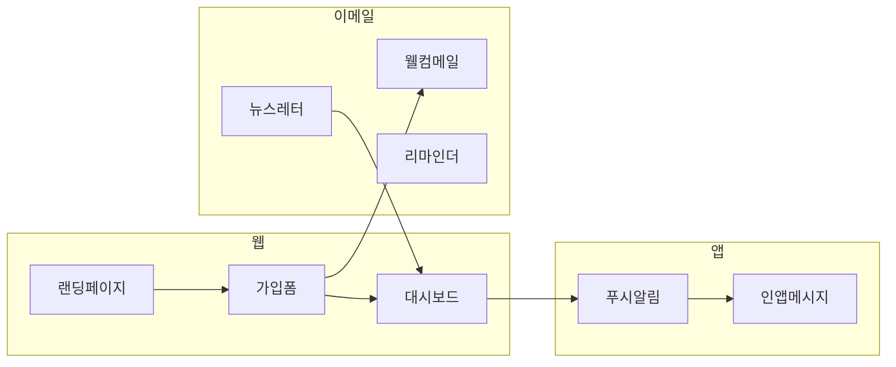

# 사용자 여정 (User Journey) 템플릿

## 1. 페르소나

### 1.1 주요 페르소나 (Primary)

#### 페르소나 A: {이름}

| 항목 | 내용 |
|------|------|
| 이름 | {가상의 이름} |
| 나이 | {나이} |
| 직업 | {직업} |
| 특징 | {주요 특징} |
| 기술 숙련도 | 초급/중급/고급 |
| 사용 기기 | 모바일 위주/데스크톱 위주/혼합 |

**인용구**: "{이 페르소나를 대표하는 한 문장}"

##### 목표
- {사용자가 달성하고자 하는 것}

##### 불편함 (Pain Points)
- {현재 겪고 있는 문제}
- 근거: "인터뷰 참여자 5명 중 4명이 언급"

##### 기대 (Expectations)
- {서비스에 기대하는 것}

##### 행동 패턴
- 사용 시간대: {주로 사용하는 시간}
- 사용 빈도: {일간/주간 사용 빈도}
- 대체 솔루션: {현재 사용 중인 대안}

---

#### 페르소나 B: {이름}

| 항목 | 내용 |
|------|------|
| 이름 | {가상의 이름} |
| 나이 | {나이} |
| 직업 | {직업} |
| 특징 | {주요 특징} |
| 기술 숙련도 | 초급/중급/고급 |
| 사용 기기 | 모바일 위주/데스크톱 위주/혼합 |

**인용구**: "{이 페르소나를 대표하는 한 문장}"

##### 목표
- {사용자가 달성하고자 하는 것}

##### 불편함 (Pain Points)
- {현재 겪고 있는 문제}

##### 기대 (Expectations)
- {서비스에 기대하는 것}

---

### 1.2 보조 페르소나 (Secondary)

| 페르소나 | 설명 | 비율 | 핵심 니즈 |
|----------|------|------|----------|
| {이름 C} | {간단한 설명} |  | {핵심 니즈} |

### 1.3 안티 페르소나 (Anti-Persona)

| 유형 | 설명 | 제외 이유 |
|------|------|----------|
| {유형1} | {설명} | {타겟에서 제외하는 이유} |

---

## 2. 사용자 시나리오

### 시나리오 1: {시나리오명} - 핵심 플로우

**페르소나**: {관련 페르소나}
**배경**: {상황 설명}
**목표**: {사용자가 달성하려는 것}
**성공 기준**: {이 시나리오의 성공 정의}

| 단계 | 행동 | 터치포인트 | 감정 | 생각 | 개선 기회 |
|------|------|-----------|------|------|----------|
| 1. 인지 | {행동} | {채널} | 😐 | "{사용자의 생각}" | {기회} |
| 2. 탐색 | {행동} | {채널} | 🙂 | "{사용자의 생각}" | {기회} |
| 3. 결정 | {행동} | {채널} | 😊 | "{사용자의 생각}" | {기회} |
| 4. 사용 | {행동} | {채널} | 😄 | "{사용자의 생각}" | {기회} |
| 5. 재방문 | {행동} | {채널} | 😊 | "{사용자의 생각}" | {기회} |

#### 정량 지표
| 단계 | 전환율 목표 | 이탈률 허용치 | 소요 시간 목표 |
|------|-----------|-------------|--------------|
| 인지 → 탐색 |  | < {시간} |
| 탐색 → 결정 |  | < {시간} |
| 결정 → 사용 |  | < {시간} |
| 사용 → 재방문 |  | - |

---

### 시나리오 2: {시나리오명} - 온보딩 플로우

**페르소나**: {관련 페르소나}
**배경**: {상황 설명}
**목표**: {사용자가 달성하려는 것}
**성공 기준**: {이 시나리오의 성공 정의}

| 단계 | 행동 | 터치포인트 | 감정 | 생각 | 개선 기회 |
|------|------|-----------|------|------|----------|
| 1. 가입 | {행동} | {채널} | {감정} | "{사용자의 생각}" | {기회} |
| 2. 프로필 설정 | {행동} | {채널} | {감정} | "{사용자의 생각}" | {기회} |
| 3. 튜토리얼 | {행동} | {채널} | {감정} | "{사용자의 생각}" | {기회} |
| 4. 첫 액션 | {행동} | {채널} | {감정} | "{사용자의 생각}" | {기회} |
| 5. Aha Moment | {행동} | {채널} | {감정} | "{사용자의 생각}" | {기회} |

---

### 시나리오 3: {시나리오명} - 문제 해결 플로우

**페르소나**: {관련 페르소나}
**배경**: {문제 상황 설명}
**목표**: {문제 해결}
**성공 기준**: {문제 해결 성공 정의}

| 단계 | 행동 | 터치포인트 | 감정 | 생각 | 개선 기회 |
|------|------|-----------|------|------|----------|
| 1. 문제 인식 | {행동} | {채널} | 😟 | "{사용자의 생각}" | {기회} |
| 2. 도움 탐색 | {행동} | {채널} | {감정} | "{사용자의 생각}" | {기회} |
| 3. 해결 시도 | {행동} | {채널} | {감정} | "{사용자의 생각}" | {기회} |
| 4. 해결 완료 | {행동} | {채널} | 😊 | "{사용자의 생각}" | {기회} |

---

### 시나리오 4: {시나리오명} - 재구매/재방문 플로우

**페르소나**: {관련 페르소나}
**배경**: {재방문 상황}
**목표**: {재구매/재사용}
**성공 기준**: {재방문 성공 정의}

| 단계 | 행동 | 터치포인트 | 감정 | 생각 | 개선 기회 |
|------|------|-----------|------|------|----------|
| 1. 리마인드 | {행동} | {채널} | {감정} | "{사용자의 생각}" | {기회} |
| 2. 재접속 | {행동} | {채널} | {감정} | "{사용자의 생각}" | {기회} |
| 3. 비교/탐색 | {행동} | {채널} | {감정} | "{사용자의 생각}" | {기회} |
| 4. 재결정 | {행동} | {채널} | {감정} | "{사용자의 생각}" | {기회} |

---

## 3. 감정 곡선

### 3.1 Mermaid 다이어그램

```mermaid
xychart-beta
    title "사용자 감정 곡선 - 시나리오 1"
    x-axis [인지, 탐색, 결정, 사용, 재방문]
    y-axis "감정 수준" 0 --> 10
    line [4, 6, 8, 9, 7]
```

### 3.2 감정 포인트 상세 분석

| 단계 | 감정 수준 | 감정 이모지 | 주요 감정 | 원인 | 개선 방안 |
|------|----------|-----------|----------|------|----------|
| 인지 | 4/10 | 😐 | 호기심, 의문 | {원인} | {방안} |
| 탐색 | 6/10 | 🙂 | 기대, 탐색욕 | {원인} | {방안} |
| 결정 | 8/10 | 😊 | 확신, 안심 | {원인} | {방안} |
| 사용 | 9/10 | 😄 | 만족, 성취 | {원인} | {방안} |
| 재방문 | 7/10 | 😊 | 친숙함, 신뢰 | {원인} | {방안} |

### 3.3 감정 저점 (Pain Moment) 분석

| 순간 | 감정 수준 | 원인 | 영향 | 개선 우선순위 |
|------|----------|------|------|-------------|
| {저점1} | 3/10 | {원인} | 이탈률 {%} 증가 | P0 |
| {저점2} | 4/10 | {원인} | NPS {점} 하락 | P1 |

---

## 4. 실패 경로 분석 (Drop-off Points)

### 4.1 주요 이탈 지점



### 4.2 이탈 원인 분석

| 이탈 지점 | 이탈률 | 주요 원인 | 사용자 피드백 | 개선안 |
|----------|--------|----------|-------------|--------|
| 탐색 → 결정 | 30% | {원인} | "{실제 피드백}" | {개선안} |
| 결정 → 사용 | 15% | {원인} | "{실제 피드백}" | {개선안} |
| 사용 → 재방문 | 40% | {원인} | "{실제 피드백}" | {개선안} |

### 4.3 복구 전략 (Recovery Strategy)

| 이탈 지점 | 복구 액션 | 채널 | 타이밍 |
|----------|----------|------|--------|
| 탐색 중 이탈 | {리타겟팅 광고} | {채널} | 이탈 후 {시간} |
| 결정 중 이탈 | {할인 쿠폰 발송} | {이메일} | 이탈 후 {시간} |
| 장기 미방문 | {리인게이지먼트 캠페인} | {푸시} | {일}일 후 |

---

## 5. 터치포인트 맵

### 5.1 터치포인트 목록

| 터치포인트 | 채널 | 단계 | 목적 | 중요도 | 현재 상태 |
|-----------|------|------|------|--------|----------|
| {터치포인트1} | 웹 | 인지 | {목적} | 🔴 핵심 | 구현 예정 |
| {터치포인트2} | 앱 | 사용 | {목적} | 🟡 중요 | 개선 필요 |
| {터치포인트3} | 이메일 | 재방문 | {목적} | 🟢 부가 | 운영 중 |

### 5.2 채널별 터치포인트



---

## 6. 정량 지표 대시보드

### 6.1 퍼널 분석

| 단계 | 현재 전환율 | 목표 전환율 | 갭 | 개선 영향도 |
|------|-----------|-----------|-----|-----------|
| 방문 → 가입 |  |  | {%} |  | {%} |  | {%} |  | >  | >  | > {%} | 30일 후 재방문 비율 |

---

## 7. 핵심 인사이트

### 7.1 기회 영역 (Opportunities)
| 우선순위 | 기회 | 영향 예상 | 실행 난이도 | 근거 |
|---------|------|----------|-----------|------|
| P0 | {기회1} | 높음 | 낮음 | "인터뷰 {n}명 중 {n}명 언급" |
| P1 | {기회2} | 중간 | 중간 | 데이터 분석 결과 |
| P2 | {기회3} | 중간 | 높음 | 경쟁사 벤치마킹 |

### 7.2 위험 영역 (Risks)
| 우선순위 | 위험 | 영향 예상 | 발생 가능성 | 대응 방안 |
|---------|------|----------|-----------|----------|
| 🔴 | {위험1} | 높음 | 높음 | {대응} |
| 🟡 | {위험2} | 중간 | 중간 | {대응} |

### 7.3 우선순위 액션 플랜
| 순서 | 액션 | 담당 | 기한 | 예상 효과 |
|------|------|------|------|----------|
| 1 | {액션1} | {담당} | {날짜} | 전환율 + |
| 3 | {액션3} | {담당} | {날짜} | NPS +{점} |

---

## 8. 연구 근거

### 8.1 사용자 리서치 요약

| 연구 방법 | 참여자 수 | 기간 | 핵심 발견 |
|----------|----------|------|----------|
| 심층 인터뷰 | {n}명 | {기간} | {핵심 발견} |
| 설문조사 | {n}명 | {기간} | {핵심 발견} |
| 사용성 테스트 | {n}명 | {기간} | {핵심 발견} |
| A/B 테스트 | {n}명 | {기간} | {핵심 발견} |

### 8.2 인용 및 참고자료

- "{직접 인용1}" - 페르소나 A 대표 참여자
- "{직접 인용2}" - 페르소나 B 대표 참여자
- 설문 결과: {n}%가 {특정 니즈}를 가장 중요하게 언급
